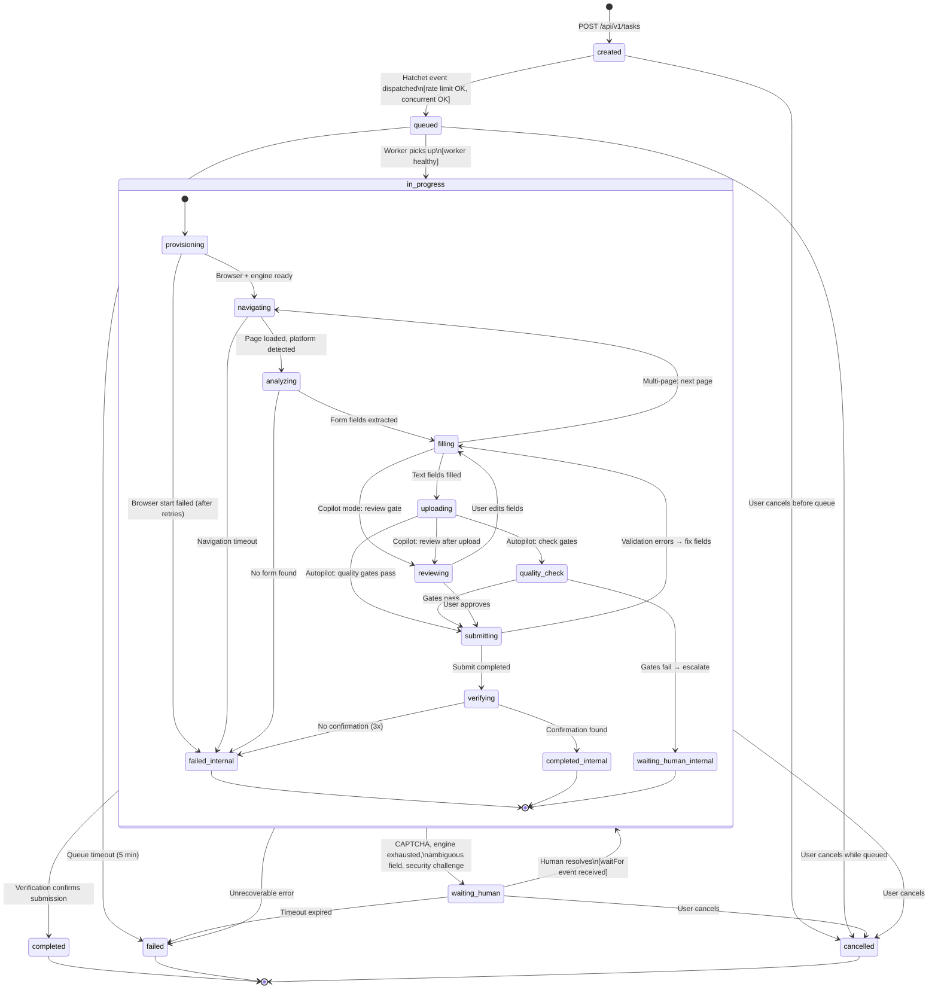
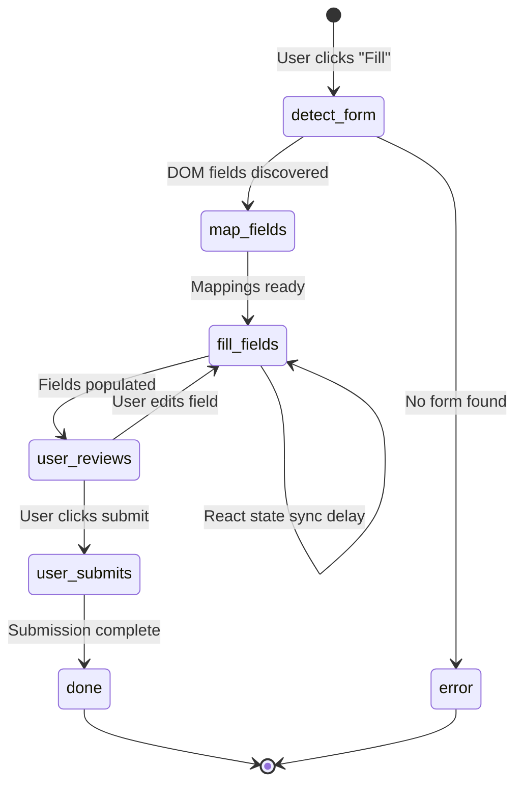
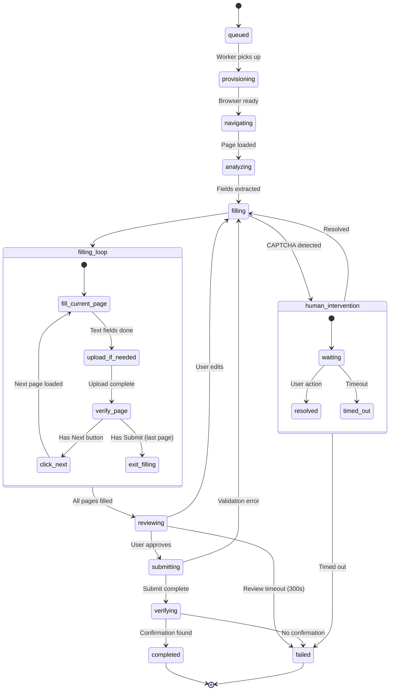
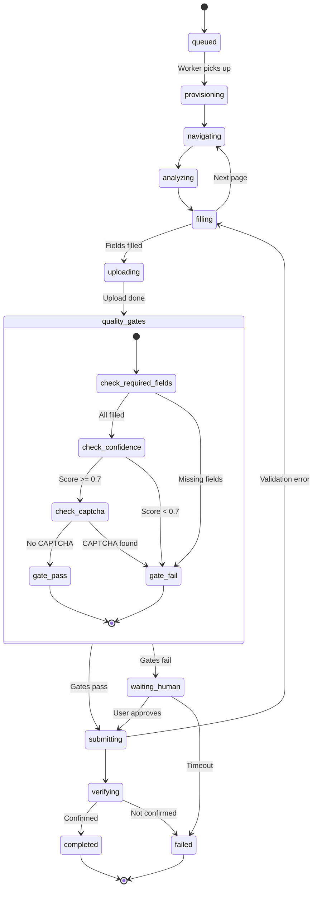
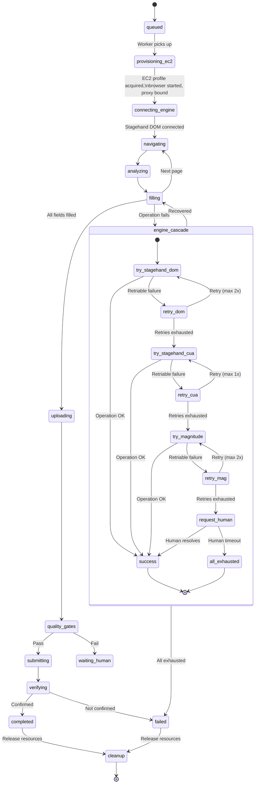
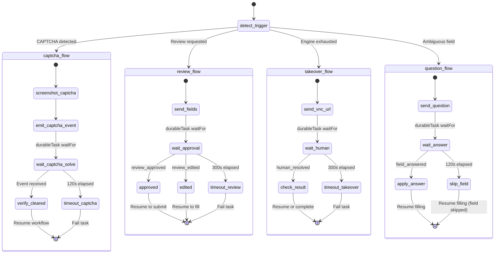

# 02 - Workflow State Machine for Application Lifecycle

> Complete state machine specification for job application workflows across all 4 tiers.
> Defines every state, transition, guard condition, and Hatchet mapping.

---

## Table of Contents

1. [Overview](#1-overview)
2. [State Definitions](#2-state-definitions)
3. [Transition Table](#3-transition-table)
4. [Tier-Specific Paths](#4-tier-specific-paths)
5. [Sub-State Machines](#5-sub-state-machines)
6. [Error States and Recovery](#6-error-states-and-recovery)
7. [Hatchet Task Mapping](#7-hatchet-task-mapping)
8. [Mermaid State Diagrams](#8-mermaid-state-diagrams)
9. [Database & Schema Alignment](#9-database--schema-alignment)
10. [WebSocket Progress Events](#10-websocket-progress-events)

---

## 1. Overview

The application lifecycle spans from task creation in the API to final verification of submission. The state machine has two layers:

1. **Persisted status** (`taskStatus` in `task.schema.ts`): `created`, `queued`, `in_progress`, `waiting_human`, `completed`, `failed`, `cancelled`. These are stored in the database and visible to the frontend.

2. **Internal phases** (`ApplicationPhase` in `sandbox.ts`): `provisioning`, `navigating`, `analyzing`, `filling`, `uploading`, `reviewing`, `submitting`, `verifying`, `waiting_human`, `completed`, `failed`. These are transient sub-states within `in_progress`, broadcast via WebSocket for real-time UI updates but not persisted as the task status.

### State Layer Mapping

```
DB taskStatus     ApplicationPhase (internal)
─────────────     ──────────────────────────
created           (none - API only)
queued            (none - waiting for worker pickup)
in_progress  ───→ provisioning
                  navigating
                  analyzing
                  filling
                  uploading
                  reviewing
                  submitting
                  verifying
waiting_human ──→ waiting_human
completed    ───→ completed
failed       ───→ failed
cancelled        (none - API/user cancellation)
```

### Tier Summary

| Tier | Name | Mode | Infrastructure | Engine |
|------|------|------|----------------|--------|
| Free | Extension | N/A | User's browser | Chrome extension content script |
| Starter ($19/mo) | Copilot | copilot | EC2 + AdsPower (MVP) / Browserbase (V2) | Selenium (MVP) / Stagehand DOM (V2) |
| Pro ($39/mo) | Autopilot | autopilot | EC2 + AdsPower (MVP) / Browserbase (V2) | Selenium (MVP) / Stagehand DOM (V2) |
| Premium ($79-99/mo) | Dedicated | autopilot | Dedicated EC2 + AdsPower | Stagehand + Magnitude fallback + VNC |

---

## 2. State Definitions

### 2.1 Persisted States (taskStatus)

| State | Description | Entry Condition | Exit Condition |
|-------|-------------|-----------------|----------------|
| `created` | Task record exists in DB. API has validated inputs (URL, resume, plan limits). | `POST /api/v1/tasks` completes | Hatchet event `task:created` dispatched |
| `queued` | Hatchet has received the event. Worker has not yet picked it up. Rate limits and concurrency checks passed. | Hatchet event dispatched | Worker begins `start-browser` task |
| `in_progress` | Worker is actively processing. Internal phase tracked via ApplicationPhase. | Worker picks up workflow | Workflow reaches terminal state or human intervention needed |
| `waiting_human` | Workflow is paused, waiting for user action. Hatchet `durableTask` + `waitFor`. | CAPTCHA detected, review requested, engine exhausted, or ambiguous field | User resolves via WebSocket event or timeout expires |
| `completed` | Application submitted and verified. Confirmation ID and screenshot stored. | Verification step confirms submission | Terminal state |
| `failed` | Unrecoverable error. All retry/fallback paths exhausted. | Max retries exceeded, browser died, budget exceeded, or timeout | Terminal state (user can manually retry by creating new task) |
| `cancelled` | User or system cancelled the task. | User clicks cancel, admin action, or system timeout | Terminal state |

### 2.2 Internal Phases (ApplicationPhase)

These phases exist within `in_progress` and provide granular progress tracking.

| Phase | Description | Typical Duration | Progress % Range |
|-------|-------------|------------------|-----------------|
| `provisioning` | Acquiring browser profile, starting browser, connecting engine, restoring session state. | 3-10s (EC2) / 5-15s (Browserbase) | 0-10% |
| `navigating` | Loading the job URL, waiting for page settlement, detecting platform. | 2-8s | 10-15% |
| `analyzing` | Extracting form fields, detecting multi-page structure, identifying field types and required/optional status. | 3-10s | 15-25% |
| `filling` | Mapping user data to form fields, filling values, handling dropdowns/checkboxes, answering screening questions via QA bank or LLM. | 10-60s (depends on field count) | 25-65% |
| `uploading` | Uploading resume file via CDP FileChooser interception. May include cover letter. | 2-10s | 65-75% |
| `reviewing` | (Copilot only) Filled fields sent to frontend for user review. Workflow paused. | 0-300s (user dependent) | 75-80% |
| `submitting` | Clicking submit button, waiting for form submission to complete, handling validation errors. | 3-15s | 80-90% |
| `verifying` | Checking for confirmation page, extracting confirmation ID, capturing post-submission screenshot. | 3-10s | 90-100% |
| `waiting_human` | Workflow paused for human intervention (CAPTCHA, engine exhausted, security challenge). VNC/LiveView URL provided. | 0-120s (timeout) | Paused |

---

## 3. Transition Table

Each row defines a legal state transition with its trigger, guard conditions, and side effects.

### 3.1 Top-Level Transitions (taskStatus)

| # | From | To | Trigger | Guard | Actions |
|---|------|----|---------|-------|---------|
| T1 | `created` | `queued` | API dispatches Hatchet event `task:created` | Rate limit check passed, concurrent task limit not exceeded | Emit `task:created` event, record `startedAt` |
| T2 | `queued` | `in_progress` | Worker picks up workflow, begins `start-browser` task | Worker healthy, Hatchet connection active | Set phase to `provisioning`, publish state_change via Redis |
| T3 | `in_progress` | `waiting_human` | CAPTCHA detected, review requested, or engine exhausted | Human intervention handler configured, VNC/LiveView available | Publish `human_needed` event with VNC URL, start timeout timer |
| T4 | `waiting_human` | `in_progress` | User resolves intervention (CAPTCHA solved, review approved, manual action complete) | Hatchet `waitFor` event received | Resume workflow from paused step, publish state_change |
| T5 | `waiting_human` | `failed` | Intervention timeout expired (default 120s) | No user response within timeout | Record error `HUMAN_TIMEOUT`, release resources |
| T6 | `in_progress` | `completed` | Verification confirms submission | Confirmation ID or confirmation page detected | Record `completedAt`, store confirmation, capture screenshot, release browser |
| T7 | `in_progress` | `failed` | Unrecoverable error | All retries and fallback cascade levels exhausted | Record error code/message, capture error screenshot, release browser |
| T8 | `*` (any non-terminal) | `cancelled` | User cancels via API, or system timeout (30 min max workflow duration) | Task is not already in terminal state | Abort Hatchet workflow, release browser, decrement usage counters |
| T9 | `in_progress` | `failed` | Budget exceeded | Token spend exceeds per-application limit | AbortController.abort(), record `BUDGET_EXCEEDED` error |

### 3.2 Internal Phase Transitions (within in_progress)

| # | From Phase | To Phase | Trigger | Guard | Actions |
|---|-----------|----------|---------|-------|---------|
| P1 | (entry) | `provisioning` | Worker starts workflow | - | Acquire profile, start browser, connect engine |
| P2 | `provisioning` | `navigating` | Browser started, engine connected | CDP URL valid, engine.isConnected() | Navigate to job URL |
| P3 | `navigating` | `analyzing` | Page loaded, platform detected | page.url matches job URL, DOM settled | Run form analysis (extract fields, detect multi-page) |
| P4 | `analyzing` | `filling` | Form structure extracted | At least 1 fillable field detected | Begin field mapping and filling |
| P5 | `filling` | `uploading` | All text/select/checkbox fields filled | No remaining unfilled required text fields | Trigger file upload (resume) |
| P6 | `filling` | `reviewing` | Fields filled AND mode == "copilot" | Copilot mode, fields ready for review | Send field_review event to frontend, pause |
| P7 | `uploading` | `reviewing` | Resume uploaded AND mode == "copilot" | Copilot mode | Send review data, pause |
| P8 | `uploading` | `submitting` | Resume uploaded AND mode == "autopilot" | Quality gates passed (confidence >= threshold) | Click submit |
| P9 | `reviewing` | `submitting` | User approves review | Hatchet `waitFor("review_approved")` received | Click submit |
| P10 | `reviewing` | `filling` | User edits fields during review | Hatchet `waitFor("review_edited")` with corrections | Re-fill corrected fields |
| P11 | `submitting` | `verifying` | Submit action completed | No form validation errors | Check for confirmation |
| P12 | `submitting` | `filling` | Form validation error on submit | Validation errors detected on page | Extract errors, fix fields, retry |
| P13 | `verifying` | (exit to `completed`) | Confirmation detected | Confirmation ID or thank-you page found | Capture screenshot, record result |
| P14 | `verifying` | (exit to `failed`) | No confirmation after retries | 3 verification attempts failed | Record `VERIFICATION_FAILED` |
| P15 | `filling` | `navigating` | Multi-page form: current page complete | "Next" button detected and clicked | Navigate to next page, re-analyze |
| P16 | (any phase) | `waiting_human` | CAPTCHA detected | CAPTCHA detector returns positive | Pause workflow, emit VNC URL |
| P17 | (any phase) | `waiting_human` | Engine exhausted (all cascade levels failed) | Fallback cascade exhausted, human tier available | Pause for manual completion |

---

## 4. Tier-Specific Paths

### 4.1 Free Tier (Chrome Extension)

The Free tier runs entirely in the user's browser via the Chrome extension content script. There is no server-side workflow, no Hatchet task, and no database task record. The extension operates independently.

```
User clicks "Fill" on extension popup
    │
    ▼
[detect_form]           DOMFormAnalyzer.analyzeForm(document)
    │                   Content script queries DOM for inputs/selects/textareas
    ▼
[map_fields]            DOMFormAnalyzer.mapFields(analysis, userData)
    │                   Heuristic matching: label text → user data keys
    ▼
[fill_fields]           Direct DOM manipulation: element.value = ..., dispatchEvent
    │                   Sequential field-by-field with 100ms delays for React state sync
    ▼
[user_reviews]          Extension highlights filled fields, shows confidence overlay
    │                   User can edit any field manually
    ▼
[user_submits]          User clicks the real submit button themselves
    │                   Extension does NOT auto-submit
    ▼
[done]                  Extension logs completion to chrome.storage.local
                        Syncs usage count to API: POST /api/v1/usage/record
```

**Key constraints:**
- No browser provisioning (user's own browser)
- No CAPTCHA handling (user solves themselves)
- No resume upload automation (user does manually)
- No server-side state tracking
- QA bank synced from API via `GET /api/v1/qa-bank`

### 4.2 Starter Tier (Copilot Mode)

Server-side automation with mandatory human review before submission. Uses Hatchet workflow with `durableTask` for review pause.

```
[created] ─T1→ [queued] ─T2→ [in_progress]
                                │
                    ┌───────────┘
                    ▼
             [provisioning]        Acquire EC2 profile, start AdsPower browser,
                    │              connect Selenium (MVP) / Stagehand DOM (V2)
                    ▼
              [navigating]         page.goto(jobUrl), wait for DOM settlement,
                    │              platform detection
                    ▼
              [analyzing]          Extract form fields, detect pages, identify
                    │              field types, count required fields
                    ▼
               [filling]           Map fields to user data + QA bank,
                    │              fill sequentially, handle dropdowns
                    │
            ┌───────┤ (if multi-page)
            │       └──→ [navigating] (next page, loop back to analyzing)
            ▼
             [uploading]           Resume file upload via FileChooser
                    │
                    ▼
             ────────────────── HUMAN REVIEW GATE ──────────────────
             [reviewing]           Send filled field summary to frontend
                    │              via WebSocket field_review event.
                    │              Hatchet durableTask waitFor("review_approved")
                    │
              ┌─────┼──────────┐
              │     │          │
         [approved] │    [edited]  → back to [filling] with corrections
              │     │
              ▼     ▼
            [submitting]          Click submit, handle validation errors
                    │
                    ▼
             [verifying]          Check confirmation page, extract ID
                    │
              ┌─────┴─────┐
              ▼           ▼
         [completed]   [failed]
```

**Hatchet events consumed:**
- `review_approved` — user clicks "Submit" in the review UI
- `review_edited` — user modifies field values before approving
- `captcha_solved` — user solved CAPTCHA via VNC/LiveView

### 4.3 Pro Tier (Autopilot Mode)

Fully autonomous server-side automation. No human review gate. Quality gates replace manual review.

```
[created] ─T1→ [queued] ─T2→ [in_progress]
                                │
                    ┌───────────┘
                    ▼
             [provisioning]        Same as Starter
                    │
                    ▼
              [navigating]         Same as Starter
                    │
                    ▼
              [analyzing]          Same as Starter
                    │
                    ▼
               [filling]           Same as Starter, but no review pause
                    │
            ┌───────┤ (if multi-page)
            │       └──→ [navigating] (next page)
            ▼
             [uploading]           Resume upload
                    │
                    ▼
          ─────────────── QUALITY GATES (replaces human review) ───────────────
          │  1. All required fields filled (no blanks)                        │
          │  2. Average confidence score >= 0.7                              │
          │  3. No "low confidence" fields below 0.4                         │
          │  4. Resume uploaded successfully                                 │
          │  5. No CAPTCHA detected                                          │
          ─────────────────────────────────────────────────────────────────────
                    │
              ┌─────┴─────┐
         Gates pass     Gates fail
              │              │
              ▼              ▼
         [submitting]   [waiting_human]
              │           (review_before_submit escalation)
              ▼
          [verifying]
              │
         ┌────┴────┐
         ▼         ▼
    [completed]  [failed]
```

**Quality gate implementation:**
```typescript
interface QualityGateResult {
  passed: boolean;
  failures: string[];
  overallConfidence: number;
  lowConfidenceFields: Array<{ name: string; confidence: number }>;
}
```

If gates fail, the task transitions to `waiting_human` with reason `review_before_submit`, giving the user a chance to review and approve manually. If the user does not respond within 120s, the task fails with `QUALITY_GATE_TIMEOUT`.

### 4.4 Premium Tier (Dedicated EC2 + Engine Switching)

Full infrastructure with dedicated EC2, AdsPower anti-detect profiles, Stagehand as primary engine, Magnitude as vision fallback, and VNC for human takeover.

```
[created] ─T1→ [queued] ─T2→ [in_progress]
                                │
                    ┌───────────┘
                    ▼
          [provisioning_ec2]       Acquire dedicated EC2 profile from pool,
                    │              start AdsPower browser with anti-detect fingerprint,
                    │              bind IPRoyal residential proxy (sticky session),
                    │              start VNC stack (Xvfb + x11vnc + websockify)
                    ▼
          [connecting_engine]      Connect Stagehand DOM mode via CDP
                    │              (SandboxController.connectStagehand())
                    ▼
              [navigating]         Navigate to job URL via Stagehand
                    │
                    ▼
              [analyzing]          Stagehand extract() for form analysis
                    │              Engine orchestrator selects primary engine
                    │              based on detected platform
                    ▼
               [filling]           Stagehand agent mode with fillForm tool
                    │              Each operation wrapped in fallback cascade:
                    │
                    │   ┌─── ON FAILURE ────────────────────────┐
                    │   │                                        │
                    │   ▼                                        │
                    │  [engine_switch_check]                      │
                    │   │                                        │
                    │   ├─ retry same engine (up to N times)     │
                    │   │                                        │
                    │   ├─ switch Stagehand DOM → Stagehand CUA  │
                    │   │  (SandboxController.switchEngine)      │
                    │   │                                        │
                    │   ├─ switch Stagehand CUA → Magnitude      │
                    │   │  (vision fallback, re-navigate)        │
                    │   │                                        │
                    │   └─ all engines exhausted → [waiting_human]│
                    │      (VNC takeover)                        │
                    │                                            │
                    └────────────────────────────────────────────┘
                    │
            ┌───────┤ (if multi-page)
            │       └──→ [navigating]
            ▼
             [uploading]
                    │
                    ▼
          ─── QUALITY GATES ─── (same as Pro)
                    │
                    ▼
            [submitting]
                    │
                    ▼
             [verifying]
                    │
              ┌─────┴─────┐
              ▼           ▼
         [completed]   [failed]
                              │
                              ▼
                     [cleanup]   Stop browser, release profile,
                                 capture session state, update usage
```

---

## 5. Sub-State Machines

### 5.1 Engine Switching Sub-Machine (Premium Tier Only)

This sub-machine is entered whenever an engine operation fails and the failure is classified as potentially recoverable by switching engines.

```
[operation_failed]
    │
    ▼
[classify_failure]          FailureClassifier categorizes the error
    │
    ├─ retriable_same_engine=true
    │       │
    │       ▼
    │   [retry_same_engine]     Retry up to engine.retryCount times
    │       │
    │       ├─ success → return to caller
    │       └─ exhausted → continue below
    │
    ├─ suggestsVisionEngine=true OR failureCount >= maxFailures
    │       │
    │       ▼
    │   [capture_page_state]    PageState { url, title, scrollX, scrollY }
    │       │
    │       ▼
    │   [disconnect_current]    SandboxController.disconnectEngine()
    │       │                   CDP mutex acquired, WebSocket closed
    │       ▼
    │   [verify_browser]        HTTP GET /json/version on CDP port
    │       │                   Browser process must still be alive
    │       ├─ dead → [unrecoverable_failure]
    │       │
    │       ▼
    │   [connect_next_engine]   Follow cascade: stagehand_dom → stagehand_cua → magnitude
    │       │
    │       ▼
    │   [restore_page_state]    Navigate to saved URL, restore scroll position
    │       │
    │       ▼
    │   [verify_engine]         Confirm engine can access the page
    │       │
    │       └─ success → return to caller with new engine
    │
    └─ all_cascade_levels_exhausted
            │
            ▼
        [request_human_takeover]    Emit VNC URL, waitFor("human_resolved")
```

**Failure type to action mapping:**

| FailureSignalType | Retry Same? | Switch? | Target |
|-------------------|-------------|---------|--------|
| `selector_not_found` | Yes (2x) | Yes | Next engine |
| `selector_ambiguous` | Yes (1x) | Yes | Next engine |
| `action_no_effect` | Yes (2x) | Yes | Next engine |
| `shadow_dom_blocked` | No | Yes | Magnitude |
| `iframe_unreachable` | No | Yes | Magnitude |
| `canvas_element` | No | Yes | Magnitude |
| `dynamic_rendering` | Yes (1x) | Yes | Magnitude |
| `cdp_disconnect` | No | No | Restart browser |
| `timeout` | Yes (1x) | Yes | Next engine |
| `anti_bot_detected` | No | Yes | Magnitude (patchright) |
| `captcha_detected` | No | No | Human |
| `rate_limited` | Yes (backoff) | No | Same engine |
| `budget_exceeded` | No | No | Fail task |

### 5.2 Human Intervention Sub-Machine

Entered from any phase when human action is required.

```
[intervention_trigger]
    │
    ├─ reason=captcha
    │       │
    │       ▼
    │   [detect_captcha_type]     reCAPTCHA v2/v3, hCaptcha, Turnstile, custom
    │       │
    │       ▼
    │   [capture_screenshot]      Upload to S3, attach to intervention request
    │       │
    │       ▼
    │   [emit_human_needed]       Redis pub/sub → WebSocket → frontend
    │       │                     Include: VNC/LiveView URL, screenshot, deadline
    │       ▼
    │   [waiting_captcha]         Hatchet durableTask waitFor("captcha_solved")
    │       │                     Timeout: 120s
    │       ├─ solved → [verify_captcha_cleared] → resume
    │       └─ timeout → [fail_task] reason=CAPTCHA_TIMEOUT
    │
    ├─ reason=review_before_submit (Copilot mode)
    │       │
    │       ▼
    │   [send_field_review]       WebSocket event with filled fields + confidence scores
    │       │
    │       ▼
    │   [waiting_review]          durableTask waitFor("review_approved" | "review_edited")
    │       │                     Timeout: 300s (5 min, more generous for review)
    │       ├─ approved → resume to [submitting]
    │       ├─ edited → apply corrections, resume to [filling]
    │       └─ timeout → [fail_task] reason=REVIEW_TIMEOUT
    │
    ├─ reason=engine_exhausted
    │       │
    │       ▼
    │   [capture_full_state]      Screenshot + URL + filled fields so far
    │       │
    │       ▼
    │   [emit_takeover_request]   VNC URL for direct browser control
    │       │
    │       ▼
    │   [waiting_takeover]        durableTask waitFor("human_resolved")
    │       │                     Timeout: 300s
    │       ├─ resolved → [verify_submission] (human may have submitted)
    │       └─ timeout → [fail_task] reason=HUMAN_TIMEOUT
    │
    ├─ reason=ambiguous_field
    │       │
    │       ▼
    │   [send_field_question]     WebSocket event with field details + options
    │       │
    │       ▼
    │   [waiting_answer]          durableTask waitFor("field_answered")
    │       │                     Timeout: 120s
    │       ├─ answered → fill field with user's answer, resume
    │       └─ timeout → skip field, log warning, resume
    │
    └─ reason=security_challenge
            │
            ▼
        [emit_security_alert]     VNC URL + screenshot
            │
            ▼
        [waiting_security]        durableTask waitFor("security_resolved")
            │                     Timeout: 120s
            ├─ resolved → resume
            └─ timeout → [fail_task] reason=SECURITY_TIMEOUT
```

### 5.3 Multi-Page Form Sub-Machine

Handles forms that span multiple pages (LinkedIn Easy Apply, Workday wizards, etc.).

```
[page_entry]
    │
    ▼
[analyze_page]              Extract fields for current page
    │
    ▼
[fill_page_fields]          Map and fill fields on this page
    │
    ▼
[upload_files_if_needed]    Resume/cover letter on this page?
    │
    ▼
[verify_page_fields]        Read back all field values, compare to expected
    │
    ├─ mismatches found → [retry_mismatched_fields] → [verify_page_fields]
    │
    ▼
[detect_navigation]         Is there a Next button? Submit button? Both?
    │
    ├─ has_next_button (not last page)
    │       │
    │       ▼
    │   [click_next]            act("click Next button")
    │       │
    │       ▼
    │   [wait_page_load]        Wait for URL change or DOM mutation
    │       │
    │       └──→ [page_entry]   Loop to next page
    │
    ├─ has_submit_button (last page)
    │       │
    │       └──→ exit to [submitting] or [reviewing]
    │
    └─ neither found (error)
            │
            └──→ [fail_task] reason=NAVIGATION_ERROR
```

---

## 6. Error States and Recovery

### 6.1 Error Classification

| Error Code | Category | Retriable | Recovery Path |
|------------|----------|-----------|---------------|
| `BROWSER_CRASH` | Infrastructure | Yes (restart browser) | Re-acquire profile, restart from last checkpoint |
| `CDP_DISCONNECT` | Infrastructure | Yes (reconnect) | Reconnect engine to same CDP URL |
| `BROWSER_START_FAILED` | Infrastructure | Yes (2x) | Try different profile, then fail |
| `ENGINE_CONNECT_FAILED` | Infrastructure | Yes (try next engine) | Follow fallback cascade |
| `NAVIGATION_TIMEOUT` | Network | Yes (2x) | Retry navigation with longer timeout |
| `NAVIGATION_ERROR` | Application | Yes (1x) | Verify URL, retry |
| `FORM_NOT_FOUND` | Application | No | Fail with clear message to user |
| `FIELD_FILL_FAILED` | Automation | Yes (retry + switch engine) | Fallback cascade |
| `UPLOAD_FAILED` | Automation | Yes (2x) | Retry file upload |
| `SUBMIT_VALIDATION_ERROR` | Application | Yes (fix fields) | Extract errors, correct fields, resubmit |
| `SUBMIT_FAILED` | Application | Yes (1x) | Retry submit click |
| `VERIFICATION_FAILED` | Application | Yes (3x) | Re-check confirmation page |
| `CAPTCHA_TIMEOUT` | Human | No | Fail task |
| `REVIEW_TIMEOUT` | Human | No | Fail task |
| `HUMAN_TIMEOUT` | Human | No | Fail task |
| `BUDGET_EXCEEDED` | System | No | Abort immediately |
| `RATE_LIMITED` | System | Yes (backoff) | Exponential backoff, max 3 retries |
| `WORKFLOW_TIMEOUT` | System | No | 30-minute max workflow duration exceeded |
| `PROFILE_LOCKED` | Infrastructure | Yes (wait + retry) | Wait 10s, force-stop if stuck, retry |
| `PROXY_BLOCKED` | Network | Yes (rotate) | Rotate to new proxy session, retry |
| `SESSION_EXPIRED` | Application | Yes (re-login) | Re-authenticate via platform adapter |
| `ANTI_BOT_DETECTED` | Detection | Yes (switch engine) | Switch to Magnitude (patchright) |

### 6.2 Retry Strategy

```typescript
interface RetryConfig {
  /** Max retries per operation */
  maxRetries: number;
  /** Base delay between retries (ms) */
  baseDelayMs: number;
  /** Backoff multiplier */
  backoffFactor: number;
  /** Max delay cap (ms) */
  maxDelayMs: number;
  /** Jitter factor (0-1) to randomize delays */
  jitterFactor: number;
}

const DEFAULT_RETRY: RetryConfig = {
  maxRetries: 2,
  baseDelayMs: 1000,
  backoffFactor: 2,
  maxDelayMs: 10_000,
  jitterFactor: 0.3,
};
```

### 6.3 Recovery Checkpoints

The workflow captures checkpoint data at key transitions so it can resume from the last known good state after a failure:

| Checkpoint | Data Captured | Stored In |
|------------|---------------|-----------|
| After provisioning | cdpUrl, profileId, tier, engineType | Workflow context (closure) |
| After platform detection | platform, formFlow structure | Hatchet task output |
| After each page fill | pageIndex, filledFields, screenshotUrl | task_events table |
| After resume upload | resumeUploaded: true | Hatchet task output |
| After submission | submitAttempted: true | task_events table |
| After verification | confirmationId, screenshotUrl | task record (DB) |

---

## 7. Hatchet Task Mapping

### 7.1 MVP Workflow (Starter/Pro - EC2 Selenium)

The MVP uses a 2-step Hatchet workflow that delegates to the EC2 Python worker.

```typescript
const workflow = hatchet.workflow<WorkflowInput>({
  name: "job-application",
  onEvents: ["task:created"],
});

// Step 1: Dispatch to EC2 worker (regular task - no durable wait needed)
const dispatchTask = workflow.task({
  name: "dispatch-to-ec2",
  executionTimeout: "300s",  // 5 min max for full application
  fn: async (input, ctx) => {
    // HTTP POST to EC2 worker with full task payload
    // EC2 worker runs entire Selenium automation flow
    // Returns result or throws on failure
    // Progress updates come via webhooks to API
  },
});

// Step 2: Record result (regular task)
const recordResult = workflow.task({
  name: "record-result",
  executionTimeout: "30s",
  parents: [dispatchTask],
  fn: async (input, ctx) => {
    // Update task record with result from EC2 worker
    // Capture confirmation ID, screenshots
    // Publish completion event
  },
});
```

### 7.2 V2 Workflow (Full State Machine)

The V2 workflow runs browser automation directly in the Hatchet worker process using Stagehand/Magnitude via the SandboxController.

| Hatchet Task | Type | Timeout | Parents | Phase Coverage | Why This Type |
|-------------|------|---------|---------|----------------|---------------|
| `start-browser` | `task()` | 60s | none | provisioning | No durable wait needed; browser start is deterministic |
| `navigate-and-analyze` | `task()` | 30s | start-browser | navigating, analyzing | Deterministic; page load + extract |
| `fill-fields` | `task()` | 120s | navigate-and-analyze | filling, uploading | Longest step; includes multi-page loop |
| `check-captcha` | `durableTask()` | 180s | fill-fields | waiting_human (if CAPTCHA) | **Durable**: uses `waitFor("captcha_solved")` to pause for human |
| `review-or-submit` | `durableTask()` | 300s | check-captcha | reviewing (copilot) OR submitting (autopilot) | **Durable**: copilot mode uses `waitFor("review_approved")`; autopilot runs quality gates |
| `verify` | `task()` | 30s | review-or-submit | verifying | Deterministic check for confirmation |
| `cleanup` | `task()` | 30s | verify | (cleanup) | Always runs; stops browser, releases profile |

**Why `durableTask()` vs `task()`:**
- `task()`: For deterministic operations that run to completion without external input. If the worker crashes, Hatchet retries from scratch.
- `durableTask()`: For steps that pause and wait for external events (human CAPTCHA solve, user review approval). Uses `ctx.waitFor({ eventKey })` to park the task until an event arrives. If the worker crashes during the wait, Hatchet restores the durable context and resumes waiting.

### 7.3 SandboxController Sharing Pattern

The SandboxController (live browser connection) is shared across tasks via closure, not serialization:

```typescript
export function registerJobApplicationWorkflow(hatchet, redis, eventLogger, db) {
  const workflow = hatchet.workflow<WorkflowInput>({
    name: "job-application",
    onEvents: ["task:created"],
  });

  // Shared state via closure — NOT serialized between tasks
  let sandbox: SandboxController | null = null;
  let orchestrator: IEngineOrchestrator | null = null;

  const startBrowser = workflow.task({
    name: "start-browser",
    fn: async (input) => {
      sandbox = new SandboxController(buildConfig(input));
      await sandbox.startSession();
      await sandbox.connectEngine("stagehand");
      orchestrator = new EngineOrchestrator(sandbox);
      return { cdpUrl: sandbox.getCdpUrl(), engine: sandbox.getCurrentEngine() };
    },
  });

  const fillFields = workflow.task({
    name: "fill-fields",
    parents: [startBrowser],
    fn: async (input) => {
      // Access sandbox via closure — live CDP connection
      return orchestrator!.executeWithFallback(
        async (engine) => { /* fill logic */ },
        { taskId: input.taskId, step: "fill" },
      );
    },
  });

  // ... more tasks accessing sandbox via closure ...

  workflow.task({
    name: "cleanup",
    parents: [/* last task */],
    fn: async () => {
      await sandbox?.destroy();
      sandbox = null;
      orchestrator = null;
    },
  });

  return workflow;
}
```

### 7.4 Hatchet Events

| Event Key | Produced By | Consumed By | Payload |
|-----------|-------------|-------------|---------|
| `task:created` | API task.service | Worker workflow trigger | `{ taskId, jobUrl, userId, resumeId, mode }` |
| `captcha_solved` | API (from frontend WebSocket) | `check-captcha` durableTask waitFor | `{ taskId, solvedBy: "user" }` |
| `review_approved` | API (from frontend) | `review-or-submit` durableTask waitFor | `{ taskId }` |
| `review_edited` | API (from frontend) | `review-or-submit` durableTask waitFor | `{ taskId, corrections: {...} }` |
| `human_resolved` | API (from frontend) | Any durableTask with human wait | `{ taskId, notes?: string }` |
| `field_answered` | API (from frontend) | Fill task (if ambiguous field pause) | `{ taskId, fieldName, value }` |
| `task:cancelled` | API | Worker (workflow cancellation) | `{ taskId }` |

---

## 8. Mermaid State Diagrams

### 8.1 Overall System State Machine



### 8.2 Free Tier Path (Extension)



### 8.3 Starter Tier Path (Copilot)



### 8.4 Pro Tier Path (Autopilot)



### 8.5 Premium Tier Path (Engine Switching)



### 8.6 Human Intervention Sub-Machine



---

## 9. Database & Schema Alignment

### 9.1 Task Status Enum Alignment

The `taskStatus` Zod enum in `task.schema.ts` currently defines:

```typescript
export const taskStatus = z.enum([
  "created",
  "queued",
  "in_progress",
  "waiting_human",
  "completed",
  "failed",
  "cancelled",
]);
```

This enum covers all persisted states in the state machine. No changes needed.

### 9.2 ApplicationPhase Alignment

The `ApplicationPhase` type in `sandbox.ts` defines internal phases:

```typescript
export type ApplicationPhase =
  | "provisioning"
  | "navigating"
  | "analyzing"
  | "filling"
  | "uploading"
  | "reviewing"
  | "submitting"
  | "verifying"
  | "waiting_human"
  | "completed"
  | "failed";
```

This type is used for WebSocket progress events only and is NOT stored as the task's `status` field. The `currentStep` field on the task record (`z.string().nullable()`) stores the current phase name for display purposes.

### 9.3 Task Record Updates per Transition

| Transition | DB Fields Updated |
|------------|-------------------|
| created → queued | `status: "queued"` |
| queued → in_progress | `status: "in_progress"`, `startedAt: new Date()`, `currentStep: "provisioning"` |
| Phase change (within in_progress) | `currentStep: <phase>`, `progress: <pct>` |
| in_progress → waiting_human | `status: "waiting_human"`, `currentStep: <reason>` |
| waiting_human → in_progress | `status: "in_progress"`, `currentStep: <resumed_phase>` |
| → completed | `status: "completed"`, `completedAt: new Date()`, `progress: 100`, `durationSeconds` |
| → failed | `status: "failed"`, `errorCode`, `errorMessage`, `completedAt: new Date()` |
| → cancelled | `status: "cancelled"`, `completedAt: new Date()` |

### 9.4 Event Log (task_events table)

Every state transition and significant action is logged to the `task_events` table for debugging and analytics:

| event_type | Description | Key data fields |
|------------|-------------|-----------------|
| `state_change` | Top-level status transition | `from`, `to`, `trigger` |
| `phase_change` | Internal phase transition | `from`, `to`, `trigger` |
| `checkpoint` | Workflow milestone | `subType` (workflow_started, workflow_completed, etc.) |
| `field_filled` | Individual field fill | `name`, `value`, `confidence`, `source` |
| `captcha_detected` | CAPTCHA found | `type` (recaptcha_v2, hcaptcha, etc.) |
| `human_takeover` | Human intervention started | `reason`, `interventionUrl` |
| `engine_switch` | Engine changed | `from`, `to`, `reason`, `durationMs` |
| `engine_operation` | Engine action result | `engine`, `operation`, `success`, `durationMs` |
| `screenshot` | Screenshot captured | `url`, `label` |
| `error` | Error occurred | `code`, `message`, `retriable` |

---

## 10. WebSocket Progress Events

The frontend receives real-time updates via WebSocket (Redis pub/sub channel `tasks:{userId}`).

### 10.1 Event Types

| Event Type | When Sent | Payload Shape |
|------------|-----------|---------------|
| `state_change` | Task status changes (DB level) | `{ taskId, from, to, timestamp }` |
| `progress` | Internal phase progress | `{ taskId, step, pct, message }` |
| `field_review` | Copilot mode: fields ready for review | `{ taskId, fields: [{ name, value, confidence, source }] }` |
| `human_needed` | Human intervention required | `{ taskId, reason, vncUrl, screenshotUrl, deadline }` |
| `completed` | Task finished successfully | `{ taskId, confirmationId, screenshotUrl }` |
| `error` | Task failed | `{ taskId, errorCode, errorMessage }` |

### 10.2 Progress Percentage Mapping

| Phase | Progress % | Display Text |
|-------|-----------|--------------|
| provisioning | 0-10 | "Starting browser..." |
| navigating | 10-15 | "Loading application page..." |
| analyzing | 15-25 | "Analyzing form fields..." |
| filling | 25-65 | "Filling field: {fieldName}" (increments per field) |
| uploading | 65-75 | "Uploading resume..." |
| reviewing | 75-80 | "Waiting for your review..." |
| submitting | 80-90 | "Submitting application..." |
| verifying | 90-100 | "Verifying submission..." |
| completed | 100 | "Application submitted!" |

---

*Last updated: 2026-02-13*
*Depends on: [task.schema.ts](../../packages/shared/src/schemas/task.schema.ts), [01-shared-interfaces.md](01-shared-interfaces.md)*
*Consumed by: Worker implementation, Frontend progress UI, API task service*
