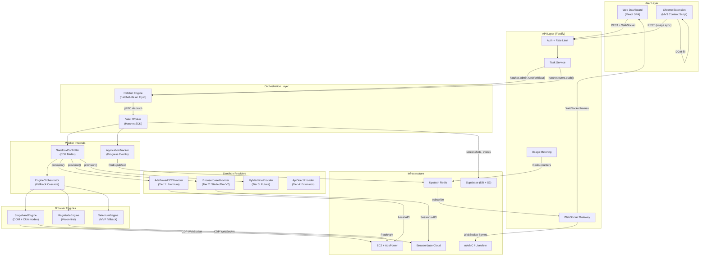

# 08 - Comprehensive Hatchet Integration Plan

> Definitive integration blueprint for the WeKruit Valet multi-tier browser automation system.
> Synthesizes architecture documents 01-07, the existing codebase, and deployment constraints
> into an actionable plan covering shared interfaces, Hatchet workflows, browser engines,
> sandbox providers, Chrome extension, database schema, API contracts, and phased implementation.

---

## Table of Contents

1. [Executive Summary](#1-executive-summary)
2. [System Architecture](#2-system-architecture)
3. [Interface to Implementation Map](#3-interface-to-implementation-map)
4. [Hatchet Workflow Design](#4-hatchet-workflow-design)
5. [Data Flow Between Components](#5-data-flow-between-components)
6. [Integration Points](#6-integration-points)
7. [New File Structure](#7-new-file-structure)
8. [Database Schema Changes](#8-database-schema-changes)
9. [API Contract Changes](#9-api-contract-changes)
10. [Implementation Phases](#10-implementation-phases)
11. [Testing Strategy](#11-testing-strategy)
12. [Risk Register](#12-risk-register)
13. [Cost Model](#13-cost-model)

---

## 1. Executive Summary

WeKruit Valet is a job application automation platform that fills out web forms on behalf of users across ATS platforms (LinkedIn, Greenhouse, Lever, Workday). The system currently operates with a mock-based Hatchet workflow that simulates browser automation through adapters. This plan defines the concrete integration of real browser automation engines (Stagehand v3 and Magnitude), sandbox infrastructure providers (AdsPower on EC2, Browserbase, Fly Machines), and a Chrome extension free tier into the existing Hatchet orchestration layer.

The architecture follows a multi-tier model where each subscription tier maps to a distinct infrastructure stack and engine cascade. Free-tier users get a Chrome extension that fills forms using DOM manipulation in their own browser. Starter and Pro users get server-side automation via Hatchet workflows backed by EC2+AdsPower (MVP) or Browserbase (V2), with Stagehand as the primary engine and Magnitude as a vision-based fallback. Premium users get dedicated EC2 instances with the full engine cascade (Stagehand DOM, Stagehand CUA, Magnitude, human takeover via VNC).

The integration preserves the existing `job-application` workflow structure (DAG of tasks with durable waits for CAPTCHA and review), replaces mock adapters with real engine implementations, and adds a `SandboxController` that manages the CDP mutex between engines. All changes are backward-compatible with the current database schema, with additive-only DDL for new tables.

---

## 2. System Architecture

### 2.1 High-Level Component Diagram



### 2.2 Data Flow Summary

```
User Action → API (validate + rate limit) → Hatchet Event → Worker Picks Up
    → SandboxProvider.provision() → Browser Started → Engine Connected via CDP
    → EngineOrchestrator runs form-fill with fallback cascade
    → Progress events → Redis pub/sub → WebSocket → Frontend
    → Durable waits for CAPTCHA/review → API pushes event → Worker resumes
    → Submit → Verify → Cleanup → Release resources
```

---

## 3. Interface to Implementation Map

### 3.1 Per-Tier Matrix

| Interface | Tier 1: Premium (EC2+AdsPower) | Tier 2: Starter/Pro (Browserbase) | Tier 2.5: Local (Companion) | Tier 3: Future (Fly Machine) | Free (Extension) |
|---|---|---|---|---|---|
| `IBrowserEngine` | `StagehandEngine` + `MagnitudeEngine` | `StagehandEngine` | `StagehandEngine` + `MagnitudeEngine` | `StagehandEngine` | N/A (content script DOM) |
| `ISandboxController` | `SandboxController` | `SandboxController` | `SandboxController` | `SandboxController` | N/A |
| `IEngineOrchestrator` | `EngineOrchestrator` (full cascade) | `EngineOrchestrator` (DOM+CUA only) | `EngineOrchestrator` (full cascade) | `EngineOrchestrator` | N/A |
| `ISandboxProvider` | `AdsPowerEC2Provider` | `BrowserbaseProvider` | `LocalDesktopProvider` | `FlyMachineProvider` | `ApiDirectProvider` (no-op) |
| `ISessionManager` | `AdsPowerSessionManager` | `BrowserbaseSessionManager` | `LocalChromeSessionManager` | `S3SessionManager` | N/A |
| `IProxyManager` | `IPRoyalProxyManager` | `BrowserbaseProxy` (no-op) | N/A (user's own IP) | `IPRoyalProxyManager` | N/A |
| `IHumanInterventionHandler` | `VncInterventionHandler` | `LiveViewInterventionHandler` | `ExtensionOverlayHandler` | `VncInterventionHandler` | In-page overlay |
| `IFormAnalyzer` | `LLMFormAnalyzer` | `LLMFormAnalyzer` | `LLMFormAnalyzer` | `LLMFormAnalyzer` | `DOMFormAnalyzer` |
| `IQABank` | `DatabaseQABank` | `DatabaseQABank` | `DatabaseQABank` | `DatabaseQABank` | `ExtensionQABank` |
| `IUsageMetering` | `UsageMeteringService` | `UsageMeteringService` | `UsageMeteringService` | `UsageMeteringService` | `ExtensionUsageService` |
| `IApplicationTracker` | `ApplicationTracker` | `ApplicationTracker` | `ApplicationTracker` | `ApplicationTracker` | N/A |

### 3.2 File Path Reference

| Implementation | File Path | Status |
|---|---|---|
| `StagehandEngine` | `apps/worker/src/engines/stagehand-engine.ts` | New |
| `MagnitudeEngine` | `apps/worker/src/engines/magnitude-engine.ts` | New |
| `SeleniumEngine` | `apps/worker/src/engines/selenium-engine.ts` | New (MVP) |
| `MockEngine` | `apps/worker/src/engines/mock-engine.ts` | New (testing) |
| `SandboxController` | `apps/worker/src/services/sandbox-controller.ts` | New |
| `EngineOrchestrator` | `apps/worker/src/services/engine-orchestrator.ts` | New |
| `ApplicationTracker` | `apps/worker/src/services/application-tracker.ts` | New |
| `AdsPowerEC2Provider` | `apps/worker/src/providers/adspower-ec2.ts` | New |
| `BrowserbaseProvider` | `apps/worker/src/providers/browserbase.ts` | New |
| `LocalDesktopProvider` | `apps/agent/src/providers/local-desktop.ts` | New |
| `FlyMachineProvider` | `apps/worker/src/providers/fly-machine.ts` | New (future) |
| `ApiDirectProvider` | `apps/worker/src/providers/api-direct.ts` | New |
| `LLMFormAnalyzer` | `apps/worker/src/services/llm-form-analyzer.ts` | New |
| `IPRoyalProxyManager` | `apps/worker/src/services/iproyal-proxy-manager.ts` | New |
| `VncInterventionHandler` | `apps/worker/src/services/vnc-intervention-handler.ts` | New |
| `LiveViewInterventionHandler` | `apps/worker/src/services/liveview-intervention-handler.ts` | New |
| `DatabaseQABank` | `apps/api/src/services/qa-bank.ts` | New |
| `UsageMeteringService` | `apps/api/src/services/usage-metering.ts` | New |
| `DOMFormAnalyzer` | `apps/extension/src/services/dom-form-analyzer.ts` | New |
| `ExtensionQABank` | `apps/extension/src/services/extension-qa-bank.ts` | New |

---

## 4. Hatchet Workflow Design

### 4.1 Definitive Workflow Structure

The `job-application` workflow is a DAG of 7 tasks (4 regular, 2 durable, 1 cleanup). The `SandboxController` and `EngineOrchestrator` are shared via closure across all tasks in the same workflow run, enabled by Hatchet's `StickyStrategy.SOFT`.

```
start-browser → navigate-and-analyze → fill-fields → check-captcha* → review-or-submit* → verify → cleanup
                                                        (* = durableTask)
```

### 4.2 TypeScript Workflow Definition

```typescript
// apps/worker/src/workflows/job-application.ts (V2 target)

import { Hatchet, ConcurrencyLimitStrategy, StickyStrategy } from "@hatchet-dev/typescript-sdk";
import type { Context, DurableContext } from "@hatchet-dev/typescript-sdk/v1/client/worker/context";
import type { JsonValue } from "@hatchet-dev/typescript-sdk/v1/types";

// ─── Workflow Input / Output Types ───

interface WorkflowInput {
  [key: string]: JsonValue;
  taskId: string;
  jobUrl: string;
  userId: string;
  resumeId: string;
  mode: "copilot" | "autopilot";
  tier: 1 | 2 | 3;           // Tier 4 (extension) never triggers this workflow
  subscriptionTier: string;   // "starter" | "pro" | "premium"
}

interface StartBrowserOutput {
  cdpUrl: string;
  engineType: string;
  interventionUrl: string | null;
  tier: number;
  providerType: string;
}

interface AnalyzeOutput {
  platform: string;
  formFlow: JsonValue;      // Serialized FormFlow
  totalPages: number;
  totalFields: number;
  engineSelection: JsonValue; // Serialized EngineSelection
}

interface FillOutput {
  filledFields: JsonValue[];    // Serialized FieldMapping[]
  skippedFields: JsonValue[];
  resumeUploaded: boolean;
  overallConfidence: number;
  requiresReview: boolean;
  pagesCompleted: number;
}

interface CaptchaOutput {
  captchaDetected: boolean;
  captchaSolved: boolean;
}

interface SubmitOutput {
  submitted: boolean;
  reviewApproved: boolean;
  qualityGatesPassed: boolean;
}

interface VerifyOutput {
  success: boolean;
  confirmationId: string | null;
  screenshotUrl: string | null;
}
```

### 4.3 Task-by-Task Specification

#### Task 1: `start-browser` (regular task)

| Property | Value |
|---|---|
| Type | `workflow.task()` |
| Timeout | `120s` execution, `5m` schedule |
| Retries | `2` with backoff `{ maxSeconds: 10, factor: 2 }` |
| Parents | none (entry point) |
| Phase Coverage | `provisioning` |
| Sticky | `StickyStrategy.SOFT` (workflow-level) |

**Responsibilities:**
1. Determine `SandboxProviderType` from input `tier`
2. Call `provider.provision({ userId, platform: "unknown", taskId, enableIntervention })`
3. Create `SandboxController` with the `ProvisionResult`
4. Call `controller.startSession()` and `controller.connectEngine("stagehand")`
5. Store `SandboxController` in closure-scoped variable
6. Publish `state_change: provisioning` via Redis
7. Return serializable `StartBrowserOutput`

**Output:** `{ cdpUrl, engineType, interventionUrl, tier, providerType }`

#### Task 2: `navigate-and-analyze` (regular task)

| Property | Value |
|---|---|
| Type | `workflow.task()` |
| Timeout | `60s` execution |
| Retries | `1` |
| Parents | `[startBrowser]` |
| Phase Coverage | `navigating`, `analyzing` |

**Responsibilities:**
1. Access `SandboxController` via closure
2. Navigate to `input.jobUrl` via engine
3. Detect ATS platform via `formAnalyzer.detectPlatform()`
4. Run `formAnalyzer.analyzeForm()` to extract form structure
5. Call `orchestrator.selectEngine(platform)` to determine cascade
6. Publish `state_change: navigating` then `state_change: analyzing` via Redis
7. Return serializable form analysis results

**Output:** `{ platform, formFlow, totalPages, totalFields, engineSelection }`

#### Task 3: `fill-fields` (regular task)

| Property | Value |
|---|---|
| Type | `workflow.task()` |
| Timeout | `300s` execution (large multi-page forms) |
| Retries | `0` (engine orchestrator handles retries internally) |
| Parents | `[navigateAndAnalyze]` |
| Phase Coverage | `filling`, `uploading` |

**Responsibilities:**
1. Access `SandboxController` + `EngineOrchestrator` via closure
2. For each form page:
   a. Map fields to user data + QA bank answers via `formAnalyzer.mapFields()`
   b. Fill each field using `orchestrator.executeWithFallback()` (handles engine switching)
   c. Upload resume via CDP FileChooser if needed
   d. Verify filled values by re-extracting
   e. Click "Next" if multi-page, loop back
3. Publish per-field progress updates via Redis
4. Extend timeout with `ctx.refreshTimeout("30s")` per page
5. In copilot mode, set `requiresReview: true`

**Output:** `{ filledFields, skippedFields, resumeUploaded, overallConfidence, requiresReview, pagesCompleted }`

**Engine switching within this task:**
```
orchestrator.executeWithFallback(async (engine) => {
  await engine.act(`Fill the "${field.label}" field with %value%`, {
    variables: { value: field.value }
  });
}, { taskId, step: `fill-${field.name}` })
```
The orchestrator internally retries with the same engine, then switches (DOM -> CUA -> Magnitude), then escalates to human.

#### Task 4: `check-captcha` (durable task)

| Property | Value |
|---|---|
| Type | `workflow.durableTask()` |
| Timeout | `600s` execution (10 min for human to solve) |
| Retries | `0` |
| Parents | `[fillFields]` |
| Phase Coverage | `waiting_human` (if CAPTCHA detected) |

**Responsibilities:**
1. Access `SandboxController` via closure
2. Run `interventionHandler.detect(engine)` to check for CAPTCHA
3. If no CAPTCHA: return immediately
4. If CAPTCHA detected:
   a. Capture screenshot, upload to S3
   b. Publish `human_needed` event via Redis with VNC/LiveView URL
   c. Update task status to `waiting_human` in DB
   d. Call `ctx.waitFor({ eventKey: "captcha_solved" })` (durable pause)
   e. On resume: verify CAPTCHA is cleared
   f. Update task status back to `in_progress`

**Why durable:** Uses `ctx.waitFor()` to park execution until the user solves the CAPTCHA via VNC/LiveView. If the worker crashes during the wait, Hatchet restores context and resumes waiting.

**Output:** `{ captchaDetected, captchaSolved }`

#### Task 5: `review-or-submit` (durable task)

| Property | Value |
|---|---|
| Type | `workflow.durableTask()` |
| Timeout | `300s` execution (5 min for copilot review) |
| Retries | `0` |
| Parents | `[checkCaptcha]` |
| Phase Coverage | `reviewing` (copilot) or `submitting` (autopilot) |

**Responsibilities:**

**Copilot mode:**
1. Get `fillResult` from closure or parent output
2. Send `field_review` event via Redis WebSocket with filled fields + confidence scores
3. Update task status to `waiting_human`
4. `await ctx.waitFor({ eventKey: "review_approved" })` — durable pause
5. On resume: apply any field corrections from event payload
6. Click submit via engine
7. Update task status to `in_progress`

**Autopilot mode:**
1. Run quality gates:
   - All required fields filled (no blanks)
   - Average confidence >= 0.7
   - No field below 0.4 confidence
   - Resume uploaded
   - No CAPTCHA
2. If gates pass: click submit via engine
3. If gates fail: escalate to `waiting_human` with `review_before_submit` reason, wait for approval

**Why durable:** Copilot mode uses `ctx.waitFor("review_approved")`. Autopilot mode may also wait if quality gates fail.

**Output:** `{ submitted, reviewApproved, qualityGatesPassed }`

#### Task 6: `verify` (regular task)

| Property | Value |
|---|---|
| Type | `workflow.task()` |
| Timeout | `30s` execution |
| Retries | `2` |
| Parents | `[reviewOrSubmit]` |
| Phase Coverage | `verifying` |

**Responsibilities:**
1. Access engine via closure
2. Check current page for confirmation indicators:
   - "Thank you" / "Application received" text
   - Confirmation number extraction
   - URL change to success page
3. Capture post-submission screenshot, upload to S3
4. Update task record with confirmationId, screenshot URL
5. Publish `completed` event via Redis

**Output:** `{ success, confirmationId, screenshotUrl }`

#### Task 7: `cleanup` (regular task, always runs)

| Property | Value |
|---|---|
| Type | `workflow.task()` |
| Timeout | `30s` execution |
| Retries | `0` |
| Parents | `[verify]` |
| Phase Coverage | cleanup |

**Responsibilities:**
1. `controller.destroy()` — disconnect engine, stop browser
2. `provider.release(provisionResult)` — return profile to pool
3. Record final task duration, LLM token usage
4. `usageMetering.recordApplicationEnd(userId, taskId)`
5. Null out closure references

### 4.4 On-Failure Handler

```typescript
workflow.onFailure({
  name: "handle-failure",
  fn: async (input: WorkflowInput, ctx) => {
    // 1. Capture error screenshot if browser still alive
    if (sandbox?.getEngineHandle()?.engine?.isConnected()) {
      const screenshot = await sandbox.getEngineHandle()!.engine!.screenshot();
      // Upload to S3...
    }
    // 2. Destroy sandbox controller (release all resources)
    await sandbox?.destroy();
    // 3. Update task status to "failed" in database
    // 4. Publish failure event via Redis
    await publishProgress(redis, input.userId, {
      type: "state_change",
      taskId: input.taskId,
      from: "in_progress",
      to: "failed",
      timestamp: new Date().toISOString(),
    });
    // 5. Decrement usage counters
    await usageMetering.recordApplicationEnd(input.userId, input.taskId);
    return { handled: true };
  },
});
```

### 4.5 Concurrency & Rate Limiting

```typescript
const workflow = hatchet.workflow<WorkflowInput>({
  name: "job-application",
  onEvents: ["task:created"],
  sticky: StickyStrategy.SOFT,
  concurrency: [
    {
      maxRuns: 3,
      limitStrategy: ConcurrencyLimitStrategy.GROUP_ROUND_ROBIN,
      expression: "input.userId",     // Max 3 concurrent per user
    },
    {
      maxRuns: 10,
      limitStrategy: ConcurrencyLimitStrategy.QUEUE,
      expression: "input.platform",   // Max 10 per platform
    },
  ],
});
```

Rate limits registered at worker startup:

```typescript
await hatchet.ratelimits.upsert({ key: "linkedin-api", limit: 10, duration: RateLimitDuration.MINUTE });
await hatchet.ratelimits.upsert({ key: "greenhouse-api", limit: 20, duration: RateLimitDuration.MINUTE });
```

### 4.6 Hatchet Events Reference

| Event Key | Producer | Consumer | Payload | Notes |
|---|---|---|---|---|
| `task:created` | API `task.service.ts` | Workflow trigger | `WorkflowInput` | Triggers entire workflow |
| `captcha_solved` | API (from frontend WS) | `check-captcha` durableTask | `{ taskId }` | Resumes CAPTCHA wait |
| `review_approved` | API (from frontend) | `review-or-submit` durableTask | `{ taskId, corrections? }` | Resumes review wait |
| `review_edited` | API (from frontend) | `review-or-submit` durableTask | `{ taskId, corrections }` | User edited fields |
| `human_resolved` | API (from frontend) | Any human wait | `{ taskId, notes? }` | Generic human resolution |
| `task:cancelled` | API | Workflow cancellation | `{ taskId }` | Aborts running workflow |

---

## 5. Data Flow Between Components

### 5.1 API to Worker (Task Creation)

| Data | Format | Direction | Channel | Serialization |
|---|---|---|---|---|
| Task creation payload | `WorkflowInput` JSON | API -> Hatchet -> Worker | `hatchet.admin.runWorkflow()` | JSON (Hatchet gRPC) |
| CAPTCHA solved signal | `{ taskId }` | API -> Hatchet -> Worker | `hatchet.event.push("captcha_solved")` | JSON event |
| Review approval | `{ taskId, corrections? }` | API -> Hatchet -> Worker | `hatchet.event.push("review_approved")` | JSON event |
| Task cancellation | `{ taskId }` | API -> Hatchet -> Worker | `hatchet.runs.cancel()` | gRPC call |

### 5.2 Worker to Frontend (Real-Time Progress)

| Data | Format | Direction | Channel | Serialization |
|---|---|---|---|---|
| State transitions | `{ type: "state_change", from, to }` | Worker -> Redis -> API -> Browser | Redis pub/sub -> WebSocket | JSON |
| Progress updates | `{ type: "progress", step, pct, message }` | Worker -> Redis -> API -> Browser | Redis pub/sub -> WebSocket | JSON |
| Field review data | `{ type: "field_review", fields[] }` | Worker -> Redis -> API -> Browser | Redis pub/sub -> WebSocket | JSON |
| Human intervention | `{ type: "human_needed", reason, vncUrl }` | Worker -> Redis -> API -> Browser | Redis pub/sub -> WebSocket | JSON |
| Completion | `{ type: "completed", confirmationId }` | Worker -> Redis -> API -> Browser | Redis pub/sub -> WebSocket | JSON |

### 5.3 Worker Internal (Between Hatchet Tasks)

| Boundary | Data | How Passed | Serializable |
|---|---|---|---|
| start-browser -> navigate-and-analyze | `StartBrowserOutput` | `ctx.parentOutput()` | Yes (JSON) |
| navigate-and-analyze -> fill-fields | `AnalyzeOutput` | `ctx.parentOutput()` | Yes (JSON) |
| fill-fields -> check-captcha | `FillOutput` | `ctx.parentOutput()` | Yes (JSON) |
| (all tasks) | `SandboxController` | Closure variable | No (live object) |
| (all tasks) | `EngineOrchestrator` | Closure variable | No (live object) |

### 5.4 Extension to API

| Data | Format | Direction | Channel |
|---|---|---|---|
| Usage recording | `{ count, period }` | Extension -> API | `POST /api/v1/usage/record` |
| QA bank sync | `QAEntry[]` | API -> Extension | `GET /api/v1/qa-bank` |
| Answer generation | `{ question, context }` | Extension -> API | `POST /api/v1/extension/generate-answer` |
| Auth token | JWT | Extension -> API | `Authorization: Bearer` header |

### 5.5 Worker to Infrastructure

| Boundary | Data | Protocol | Notes |
|---|---|---|---|
| Worker -> AdsPower | Profile management | HTTP REST (localhost:50325) | On EC2, same machine |
| Worker -> Browserbase | Session management | HTTPS REST | Cloud API |
| Worker -> Browser | CDP commands | WebSocket | `ws://host:port/devtools/browser/id` |
| Worker -> Supabase S3 | Screenshots, artifacts | HTTPS (S3 protocol) | `forcePathStyle: true` |
| Worker -> Supabase DB | Event logging, task updates | TCP (postgres) | Transaction pooler (port 6543) |

---

## 6. Integration Points

### 6.1 Existing Files That Need Changes

#### `apps/worker/src/workflows/job-application.ts` (MAJOR REWRITE)

**Current state:** Mock-based workflow using `LinkedInMockAdapter` with simulated delays.

**Changes:**
- Replace `LinkedInMockAdapter` with real `SandboxController` + `EngineOrchestrator`
- Add closure-scoped `sandbox` and `orchestrator` variables
- Replace `startBrowser` task body: real provisioning via `ISandboxProvider`
- Replace `analyzeForm` task body: real form extraction via `IFormAnalyzer`
- Replace `fillFields` task body: real field filling via `orchestrator.executeWithFallback()`
- Replace `uploadResume` task body: real CDP FileChooser upload
- Keep `checkCaptcha` durable task structure, wire to `IHumanInterventionHandler`
- Keep `submit` durable task structure, add quality gates for autopilot mode
- Add `cleanup` task for resource release
- Add `workflow.onFailure()` handler
- Add `StickyStrategy.SOFT` and concurrency config
- Accept `tier` and `subscriptionTier` in `WorkflowInput`

#### `apps/worker/src/main.ts` (MODERATE)

**Changes:**
- Import and instantiate sandbox providers based on environment config
- Register rate limits at startup: `hatchet.ratelimits.upsert()`
- Pass providers and services to workflow registration function
- Add health check endpoint for Fly.io
- Increase slot count or make configurable via env var

#### `apps/api/src/modules/tasks/task.service.ts` (MODERATE)

**Changes:**
- Add `tier` routing logic: map `subscriptionTier` to `SandboxTier`
- Include `tier` and `subscriptionTier` in workflow input
- Add `checkRateLimit()` call before dispatching workflow
- Add endpoints for CAPTCHA solve, review approve, and human resolved events
- Add `recordApplicationStart()` / `recordApplicationEnd()` calls

#### `packages/shared/src/schemas/task.schema.ts` (MINOR)

**Changes:**
- Add `tier` field to `createTaskRequest` (optional, server-determined)
- Add `engineType` field to `taskSchema` for tracking which engine was used
- Add `switchCount` field for engine switch tracking

#### `packages/db/src/schema/tasks.ts` (MINOR)

**Changes:**
- Add `engine_type` column (varchar)
- Add `engine_switch_count` column (integer, default 0)
- Add `intervention_count` column (integer, default 0)
- Add `session_id` column (varchar, for Browserbase/AdsPower session tracking)

#### `packages/contracts/src/tasks.ts` (MODERATE)

**Changes:**
- Add `POST /tasks/:id/approve` — approve copilot review
- Add `POST /tasks/:id/captcha-solved` — signal CAPTCHA solved
- Add `POST /tasks/:id/human-resolved` — generic human resolution
- Add `GET /tasks/:id/live-view` — get VNC/LiveView URL
- Add `GET /tasks/:id/events` — get event timeline for a task

### 6.2 New Files to Create

See [Section 7: New File Structure](#7-new-file-structure) for the complete list.

---

## 7. New File Structure

```
apps/
  worker/
    src/
      engines/                              # IBrowserEngine implementations
        stagehand-engine.ts                 # Stagehand v3 wrapper (DOM + CUA modes)
        magnitude-engine.ts                 # Magnitude wrapper (vision-first)
        selenium-engine.ts                  # WebDriver wrapper (MVP)
        mock-engine.ts                      # Mock for testing
        index.ts                            # Engine factory
      providers/                            # ISandboxProvider implementations
        adspower-ec2.ts                     # Tier 1: AdsPower Local API + EC2
        browserbase.ts                      # Tier 2: Browserbase Sessions API
        fly-machine.ts                      # Tier 3: Fly Machines (future)
        api-direct.ts                       # Tier 4: No-op provider
        index.ts                            # Provider factory (tier -> provider)
      services/                             # Core services
        sandbox-controller.ts               # CDP mutex, engine lifecycle
        engine-orchestrator.ts              # Fallback cascade, failure classification
        application-tracker.ts              # Progress events, state transitions
        llm-form-analyzer.ts                # LLM-powered form analysis
        iproyal-proxy-manager.ts            # Residential proxy management
        vnc-intervention-handler.ts         # VNC-based human intervention
        liveview-intervention-handler.ts    # Browserbase LiveView intervention
        s3-session-manager.ts               # Session state persistence (Tier 3)
        browserbase-session-manager.ts      # Browserbase Contexts API
        adspower-session-manager.ts         # AdsPower profile persistence
        failure-classifier.ts               # Error -> FailureSignal mapping
        quality-gates.ts                    # Autopilot quality checks
      workflows/
        job-application.ts                  # REWRITTEN: real engine integration
        batch-application.ts                # NEW: batch workflow (Pro+)

  extension/                                # Chrome Extension (MV3)
    manifest.json
    src/
      background/
        service-worker.ts                   # Event-driven SW
      content-scripts/
        form-detector.ts                    # Detect ATS forms on page
        form-filler.ts                      # Fill fields via DOM
        overlay.ts                          # Confidence overlay UI
      sidepanel/
        App.tsx                             # React side panel
        components/                         # UI components
      services/
        dom-form-analyzer.ts                # IFormAnalyzer (DOM-based)
        extension-qa-bank.ts                # IQABank (chrome.storage.local)
        extension-usage.ts                  # Usage tracking + sync
        api-client.ts                       # REST client for Valet API
      shared/
        types.ts                            # Extension-specific types
        constants.ts                        # ATS URL patterns
    vite.config.ts                          # Build config

  api/
    src/
      services/
        qa-bank.ts                          # DatabaseQABank implementation
        usage-metering.ts                   # UsageMeteringService

packages/
  shared/
    src/
      types/
        sandbox.ts                          # NEW: all sandbox interfaces
      schemas/
        extension.schema.ts                 # NEW: extension-specific schemas

  contracts/
    src/
      extension.ts                          # NEW: extension API contracts
      tasks.ts                              # MODIFIED: new task endpoints

  db/
    src/
      schema/
        application-events.ts               # NEW: event timeline table
        qa-bank.ts                          # NEW: Q&A bank table
        extension-usage.ts                  # NEW: extension usage table
```

---

## 8. Database Schema Changes

### 8.1 New Table: `application_events`

Stores the event timeline for each task, used for real-time progress and post-hoc debugging.

```typescript
// packages/db/src/schema/application-events.ts

import {
  pgTable, pgEnum, uuid, varchar, text, integer, real,
  jsonb, timestamp, index,
} from "drizzle-orm/pg-core";
import { tasks } from "./tasks.js";

export const eventTypeEnum = pgEnum("event_type", [
  "state_change",
  "field_filled",
  "engine_switch",
  "captcha_detected",
  "human_takeover",
  "human_resolved",
  "quality_gate",
  "error",
  "checkpoint",
  "screenshot",
]);

export const applicationEvents = pgTable(
  "application_events",
  {
    id: uuid("id").defaultRandom().primaryKey(),
    taskId: uuid("task_id")
      .notNull()
      .references(() => tasks.id, { onDelete: "cascade" }),
    eventType: eventTypeEnum("event_type").notNull(),
    phase: varchar("phase", { length: 50 }),
    message: text("message"),
    metadata: jsonb("metadata").default({}),
    screenshotUrl: text("screenshot_url"),
    engineType: varchar("engine_type", { length: 50 }),
    durationMs: integer("duration_ms"),
    confidence: real("confidence"),
    createdAt: timestamp("created_at", { withTimezone: true }).defaultNow().notNull(),
  },
  (table) => [
    index("idx_app_events_task").on(table.taskId),
    index("idx_app_events_task_type").on(table.taskId, table.eventType),
    index("idx_app_events_created").on(table.createdAt),
  ],
);
```

### 8.2 New Table: `qa_bank_entries`

User Q&A bank for screening question answers.

```typescript
// packages/db/src/schema/qa-bank.ts

import {
  pgTable, uuid, varchar, text, integer, jsonb, timestamp, index,
} from "drizzle-orm/pg-core";
import { users } from "./users.js";

export const qaBankEntries = pgTable(
  "qa_bank_entries",
  {
    id: uuid("id").defaultRandom().primaryKey(),
    userId: uuid("user_id")
      .notNull()
      .references(() => users.id, { onDelete: "cascade" }),
    question: text("question").notNull(),
    answer: text("answer").notNull(),
    tags: jsonb("tags").default([]).notNull(),
    useCount: integer("use_count").default(0).notNull(),
    lastUsedAt: timestamp("last_used_at", { withTimezone: true }),
    createdAt: timestamp("created_at", { withTimezone: true }).defaultNow().notNull(),
    updatedAt: timestamp("updated_at", { withTimezone: true }).defaultNow().notNull(),
  },
  (table) => [
    index("idx_qa_bank_user").on(table.userId),
    index("idx_qa_bank_user_tags").on(table.userId),
  ],
);
```

### 8.3 New Table: `extension_usage`

Tracks per-period extension usage for free-tier metering.

```typescript
// packages/db/src/schema/extension-usage.ts

import {
  pgTable, uuid, varchar, integer, timestamp, index, unique,
} from "drizzle-orm/pg-core";
import { users } from "./users.js";

export const extensionUsage = pgTable(
  "extension_usage",
  {
    id: uuid("id").defaultRandom().primaryKey(),
    userId: uuid("user_id")
      .notNull()
      .references(() => users.id, { onDelete: "cascade" }),
    period: varchar("period", { length: 7 }).notNull(), // "2026-02" format
    applicationsUsed: integer("applications_used").default(0).notNull(),
    lastRecordedAt: timestamp("last_recorded_at", { withTimezone: true }).defaultNow().notNull(),
    createdAt: timestamp("created_at", { withTimezone: true }).defaultNow().notNull(),
  },
  (table) => [
    index("idx_ext_usage_user").on(table.userId),
    unique("uq_ext_usage_user_period").on(table.userId, table.period),
  ],
);
```

### 8.4 Tasks Table Additions

Add columns to the existing `tasks` table:

```typescript
// Additional columns for packages/db/src/schema/tasks.ts
engineType: varchar("engine_type", { length: 50 }),
engineSwitchCount: integer("engine_switch_count").default(0).notNull(),
interventionCount: integer("intervention_count").default(0).notNull(),
sessionId: varchar("session_id", { length: 255 }),
tier: integer("tier"),
```

### 8.5 Drizzle Config Update

Add new tables to the `tablesFilter` whitelist in `drizzle.config.ts`:

```typescript
tablesFilter: [
  // Existing
  "users", "user_profiles", "user_preferences", "resumes",
  "tasks", "task_events", "browser_profiles", "answers",
  "answer_categories", "answer_tags", "settings",
  // New
  "application_events", "qa_bank_entries", "extension_usage",
],
```

---

## 9. API Contract Changes

### 9.1 New Extension Contracts

```typescript
// packages/contracts/src/extension.ts

import { initContract } from "@ts-rest/core";
import { z } from "zod";

const c = initContract();

export const extensionContract = c.router({
  generateAnswer: {
    method: "POST",
    path: "/api/v1/extension/generate-answer",
    body: z.object({
      question: z.string().min(1).max(2000),
      jobTitle: z.string().optional(),
      company: z.string().optional(),
      jobDescription: z.string().max(10000).optional(),
    }),
    responses: {
      200: z.object({
        answer: z.string(),
        confidence: z.number().min(0).max(1),
        source: z.enum(["qa_bank", "llm_generated"]),
      }),
      429: z.object({ message: z.string(), retryAfterSeconds: z.number() }),
    },
    summary: "Generate an answer for a screening question (extension use)",
  },

  recordUsage: {
    method: "POST",
    path: "/api/v1/extension/usage",
    body: z.object({
      applicationsCompleted: z.number().int().min(1).max(10),
    }),
    responses: {
      200: z.object({
        applicationsUsed: z.number(),
        applicationsRemaining: z.number(),
        periodEnd: z.string(),
      }),
      429: z.object({ message: z.string() }),
    },
    summary: "Record extension usage count",
  },

  getQABank: {
    method: "GET",
    path: "/api/v1/extension/qa-bank",
    responses: {
      200: z.object({
        entries: z.array(z.object({
          id: z.string(),
          question: z.string(),
          answer: z.string(),
          tags: z.array(z.string()),
        })),
      }),
    },
    summary: "Sync Q&A bank entries to extension",
  },
});
```

### 9.2 New Task Action Contracts

```typescript
// Additions to packages/contracts/src/tasks.ts

approveReview: {
  method: "POST",
  path: "/api/v1/tasks/:id/approve",
  pathParams: z.object({ id: z.string().uuid() }),
  body: z.object({
    corrections: z.record(z.string()).optional(),
  }),
  responses: {
    200: z.object({ approved: z.boolean() }),
    404: z.object({ message: z.string() }),
    409: z.object({ message: z.string() }), // Task not in waiting_human
  },
  summary: "Approve copilot review and trigger submission",
},

solveCaptcha: {
  method: "POST",
  path: "/api/v1/tasks/:id/captcha-solved",
  pathParams: z.object({ id: z.string().uuid() }),
  body: z.object({}),
  responses: {
    200: z.object({ acknowledged: z.boolean() }),
    404: z.object({ message: z.string() }),
  },
  summary: "Signal that CAPTCHA has been solved by user",
},

resolveHuman: {
  method: "POST",
  path: "/api/v1/tasks/:id/resolve",
  pathParams: z.object({ id: z.string().uuid() }),
  body: z.object({
    notes: z.string().max(1000).optional(),
  }),
  responses: {
    200: z.object({ resolved: z.boolean() }),
    404: z.object({ message: z.string() }),
  },
  summary: "Signal that human intervention is complete",
},

getLiveView: {
  method: "GET",
  path: "/api/v1/tasks/:id/live-view",
  pathParams: z.object({ id: z.string().uuid() }),
  responses: {
    200: z.object({
      url: z.string().url().nullable(),
      type: z.enum(["vnc", "browserbase_liveview", "none"]),
      expiresAt: z.string().nullable(),
    }),
    404: z.object({ message: z.string() }),
  },
  summary: "Get live view URL for watching automation",
},

getEvents: {
  method: "GET",
  path: "/api/v1/tasks/:id/events",
  pathParams: z.object({ id: z.string().uuid() }),
  query: z.object({
    limit: z.coerce.number().int().min(1).max(200).default(50),
    offset: z.coerce.number().int().min(0).default(0),
  }),
  responses: {
    200: z.object({
      events: z.array(z.object({
        id: z.string(),
        eventType: z.string(),
        phase: z.string().nullable(),
        message: z.string().nullable(),
        metadata: z.record(z.unknown()),
        engineType: z.string().nullable(),
        durationMs: z.number().nullable(),
        confidence: z.number().nullable(),
        createdAt: z.string(),
      })),
      total: z.number(),
    }),
    404: z.object({ message: z.string() }),
  },
  summary: "Get event timeline for a task",
},
```

---

## 10. Implementation Phases

### Phase 1: Core Interfaces + Browserbase Tier 2 (Starter/Pro V2)

**Goal:** Replace mock adapters with real Browserbase-backed automation using Stagehand.

**New files:**
- `packages/shared/src/types/sandbox.ts` — All shared interfaces and types
- `apps/worker/src/engines/stagehand-engine.ts` — Stagehand v3 IBrowserEngine wrapper
- `apps/worker/src/engines/mock-engine.ts` — Mock for testing
- `apps/worker/src/engines/index.ts` — Engine factory
- `apps/worker/src/providers/browserbase.ts` — BrowserbaseProvider
- `apps/worker/src/providers/api-direct.ts` — No-op provider
- `apps/worker/src/providers/index.ts` — Provider factory
- `apps/worker/src/services/sandbox-controller.ts` — CDP mutex + engine lifecycle
- `apps/worker/src/services/application-tracker.ts` — Progress events
- `apps/worker/src/services/liveview-intervention-handler.ts` — Browserbase LiveView
- `apps/worker/src/services/quality-gates.ts` — Autopilot quality checks
- `apps/worker/src/services/failure-classifier.ts` — Error classification

**Modified files:**
- `apps/worker/src/workflows/job-application.ts` — Replace mock with real Stagehand
- `apps/worker/src/main.ts` — Wire up providers and services
- `packages/db/src/schema/tasks.ts` — Add engine_type, session_id columns
- `packages/shared/src/schemas/task.schema.ts` — Add new fields

**Dependencies:**
- `@browserbasehq/stagehand` v3.x
- `@anthropic-ai/sdk` (for LLM in Stagehand)

**Verification criteria:**
- [ ] Stagehand can connect to Browserbase session via CDP
- [ ] Single-page Greenhouse form filled and submitted end-to-end
- [ ] Progress events received in frontend via WebSocket
- [ ] CAPTCHA durable wait triggers and resumes correctly
- [ ] Copilot review pause and approval works
- [ ] Browser released after workflow completes
- [ ] On-failure handler cleans up resources

### Phase 2: Engine Switching + Magnitude Fallback

**Goal:** Add Magnitude as vision-based fallback engine with automatic switching.

**New files:**
- `apps/worker/src/engines/magnitude-engine.ts` — Magnitude IBrowserEngine wrapper
- `apps/worker/src/services/engine-orchestrator.ts` — Full fallback cascade
- `apps/worker/src/services/llm-form-analyzer.ts` — LLM-powered form analysis

**Modified files:**
- `apps/worker/src/workflows/job-application.ts` — Wire EngineOrchestrator into fill task
- `apps/worker/src/services/sandbox-controller.ts` — Add `switchEngine()` implementation
- `apps/worker/src/main.ts` — Register Magnitude dependencies

**Dependencies:**
- `magnitude-core` v0.3.x

**Verification criteria:**
- [ ] Stagehand DOM failure triggers switch to Stagehand CUA
- [ ] CUA failure triggers switch to Magnitude
- [ ] Engine switch preserves page state (URL, scroll position)
- [ ] Shadow DOM form (Workday) handled by Magnitude
- [ ] Failure classification correctly routes errors
- [ ] Switch events recorded in application_events table
- [ ] All 4 ATS platforms tested: LinkedIn, Greenhouse, Lever, Workday

### Phase 3: AdsPower + EC2 Premium Tier

**Goal:** Add dedicated EC2 with AdsPower anti-detect profiles for Premium users.

**New files:**
- `apps/worker/src/providers/adspower-ec2.ts` — AdsPower Local API provider
- `apps/worker/src/services/adspower-session-manager.ts` — Profile persistence
- `apps/worker/src/services/iproyal-proxy-manager.ts` — Residential proxy management
- `apps/worker/src/services/vnc-intervention-handler.ts` — VNC-based human takeover
- `packages/db/src/schema/application-events.ts` — Event timeline table
- Infrastructure: EC2 AMI with AdsPower + Xvfb + x11vnc + websockify

**Modified files:**
- `apps/worker/src/main.ts` — Add AdsPower provider registration
- `apps/worker/src/providers/index.ts` — Add tier 1 routing
- `packages/contracts/src/tasks.ts` — Add live-view, events, approve endpoints
- `apps/api/src/modules/tasks/` — Implement new endpoints

**Dependencies:**
- EC2 instance with AdsPower installed
- IPRoyal residential proxy credentials
- noVNC for browser access

**Verification criteria:**
- [ ] AdsPower profile acquired and browser started on EC2
- [ ] Stagehand connects to AdsPower browser via CDP
- [ ] Proxy bound to profile, exit IP verified
- [ ] VNC URL provided to frontend for human takeover
- [ ] Full engine cascade: DOM -> CUA -> Magnitude -> Human
- [ ] Profile returned to pool after task completion
- [ ] Session state persists across tasks

### Phase 4: Local Tier (Companion App + Extension)

**Goal:** Ship Local tier with Chrome Extension + companion native app for local automation.

**New files:**
- `apps/agent/` — Node.js companion app (Native Messaging host)
- `apps/agent/src/main.ts` — Entry point, Native Messaging protocol handler
- `apps/agent/src/providers/local-desktop.ts` — LocalDesktopProvider implementation
- `apps/agent/src/services/chrome-launcher.ts` — Chrome instance management with CDP
- `apps/agent/src/services/profile-manager.ts` — Persistent Chrome profile management
- `apps/extension/src/background/native-messaging.ts` — Extension ↔ Native Messaging bridge
- `apps/extension/package-companion.js` — Build script to package companion binary

**Modified files:**
- `apps/extension/manifest.json` — Add `nativeMessaging` permission and host declaration
- `apps/worker/src/providers/index.ts` — Add local-desktop routing (tier 2.5)
- `packages/shared/src/types/sandbox.ts` — Add LocalDesktopProvider types

**Dependencies:**
- `chrome-launcher` (for launching Chrome with CDP)
- `pkg` (for packaging companion app as standalone binary)

**Verification criteria:**
- [ ] Companion app installs via installer script
- [ ] Native Messaging host registration succeeds on Windows/macOS/Linux
- [ ] Extension connects to companion via Native Messaging
- [ ] Companion launches Chrome with persistent profile and CDP port
- [ ] Stagehand connects to local Chrome via CDP
- [ ] Full engine cascade works in local mode: DOM → CUA → Magnitude
- [ ] Chrome profile persists cookies and session state across runs
- [ ] Companion gracefully handles Chrome crashes and reconnects
- [ ] Extension falls back to API mode if companion is not running

### Phase 5: Chrome Extension Free Tier

**Goal:** Ship Chrome extension for free-tier form filling (DOM-only, no companion).

**New files (entire `apps/extension/` directory):**
- `manifest.json` — MV3 manifest with content script declarations
- `src/background/service-worker.ts` — Event-driven background
- `src/content-scripts/form-detector.ts` — ATS URL pattern matching
- `src/content-scripts/form-filler.ts` — DOM-based form filling
- `src/content-scripts/overlay.ts` — Confidence overlay
- `src/sidepanel/App.tsx` — React side panel UI
- `src/services/dom-form-analyzer.ts` — DOM-based IFormAnalyzer
- `src/services/extension-qa-bank.ts` — chrome.storage.local QABank
- `src/services/extension-usage.ts` — Usage tracking + API sync
- `src/services/api-client.ts` — Valet API REST client
- `packages/contracts/src/extension.ts` — Extension API contracts
- `packages/db/src/schema/qa-bank.ts` — Q&A bank table
- `packages/db/src/schema/extension-usage.ts` — Extension usage table
- `apps/api/src/services/qa-bank.ts` — DatabaseQABank
- `apps/api/src/services/usage-metering.ts` — UsageMeteringService

**Modified files:**
- `packages/shared/src/schemas/` — Add extension schemas
- `apps/api/src/` — Add extension routes and services
- Root `pnpm-workspace.yaml` — Add `apps/extension`
- Root `turbo.json` — Add extension build target

**Dependencies:**
- `@anthropic-ai/sdk` (for API-side answer generation)
- Vite CRXJS plugin for extension building

**Verification criteria:**
- [ ] Extension installs in Chrome with side panel
- [ ] Form detected on Greenhouse, LinkedIn, Lever pages
- [ ] Fields filled via DOM manipulation with confidence overlay
- [ ] QA bank synced from API via GET /qa-bank
- [ ] Answer generation via API for unknown questions
- [ ] Usage count tracks and enforces 10/month free limit
- [ ] User submits manually (extension never auto-submits)
- [ ] Chrome Web Store listing requirements met

### Phase 6: Quality Gates + Batch + Pro Features

**Goal:** Ship batch application workflow, auto-learn QA bank, session recording, and analytics.

**New files:**
- `apps/worker/src/workflows/batch-application.ts` — Batch orchestration
- `apps/web/src/pages/apply-batch.tsx` — Batch queue UI
- `apps/web/src/pages/task-live-view.tsx` — Embedded VNC/LiveView
- `apps/web/src/pages/task-recording.tsx` — Session recording playback
- `apps/web/src/pages/settings-billing.tsx` — Billing/plan management

**Modified files:**
- `apps/web/src/router.tsx` — Add new routes
- `packages/contracts/src/tasks.ts` — Add batch endpoints

**Verification criteria:**
- [ ] Batch workflow processes 5 URLs concurrently per user
- [ ] Individual task progress visible in batch queue
- [ ] LiveView iframe loads Browserbase session
- [ ] Quality gates block low-confidence submissions
- [ ] Auto-learn records corrected answers to QA bank
- [ ] Monthly analytics email sent

---

## 11. Testing Strategy

### Phase 1 Tests

**Unit tests:**
- `StagehandEngine`: mock CDP WebSocket, test connect/disconnect/act/extract/observe
- `BrowserbaseProvider`: mock HTTP API, test provision/release/hasCapacity
- `SandboxController`: mock provider + engine, test CDP mutex, engine lifecycle
- `ApplicationTracker`: mock Redis, test state transitions and progress events
- `QualityGates`: test pass/fail scenarios with various confidence scores

**Integration tests:**
- Stagehand + Browserbase: real session creation, navigate to test page, extract title
- Workflow smoke test: trigger `job-application` with Browserbase, verify progress events received
- Durable wait: trigger CAPTCHA check, push resolve event, verify workflow resumes

**E2E tests:**
- Create task via API -> workflow runs -> progress in WebSocket -> task completes
- Copilot mode: task pauses at review -> approve via API -> submission completes

### Phase 2 Tests

**Unit tests:**
- `MagnitudeEngine`: mock Patchright, test act/extract/observe
- `EngineOrchestrator`: mock engines, test fallback cascade (DOM -> CUA -> Magnitude -> Human)
- `FailureClassifier`: test all `FailureSignalType` mappings

**Integration tests:**
- Engine switch: Stagehand fails on shadow DOM -> auto-switch to Magnitude
- Page state preservation: URL and scroll position restored after switch

**E2E tests:**
- Workday form (shadow DOM): Stagehand fails, Magnitude succeeds
- LinkedIn Easy Apply (multi-page): full flow with engine switching

### Phase 3 Tests

**Unit tests:**
- `AdsPowerEC2Provider`: mock Local API, test profile acquire/browser start/stop
- `IPRoyalProxyManager`: mock proxy API, test getProxy/rotateIp/healthCheck
- `VncInterventionHandler`: mock VNC URL generation, test requestAndWait timeout

**Integration tests:**
- AdsPower on EC2: start browser, get CDP URL, connect Stagehand
- Proxy binding: verify exit IP changes after rotation

### Phase 4 Tests

**Unit tests:**
- `DOMFormAnalyzer`: test field detection on HTML fixtures for each ATS
- `ExtensionQABank`: test chrome.storage.local CRUD operations
- `ExtensionUsageService`: test period tracking and limit enforcement

**Integration tests:**
- Extension + API: generate answer, record usage, sync QA bank
- Content script: inject into test page, fill fields, verify DOM values

**E2E tests:**
- Install extension, navigate to Greenhouse test form, fill all fields
- Free tier limit: fill 10 forms, verify 11th is blocked

### Phase 5 Tests

**Unit tests:**
- Batch workflow: test concurrent child spawning with concurrency limits

**E2E tests:**
- Batch 5 URLs: all complete, individual progress tracked
- Quality gate failure: task escalates to human review

---

## 12. Risk Register

| # | Risk | Severity | Likelihood | Impact | Mitigation |
|---|---|---|---|---|---|
| R1 | Stagehand v3 breaking changes during development | High | Medium | Blocks all engine work | Pin exact version, vendor critical types, maintain mock engine for testing |
| R2 | Browserbase rate limits or outages | High | Medium | Starter/Pro users cannot apply | Implement circuit breaker, queue tasks for retry, show user-friendly error |
| R3 | AdsPower license cost scales poorly | Medium | Medium | Premium tier unprofitable | Monitor per-profile costs, cap concurrent profiles, evaluate Camoufox alternative |
| R4 | Supabase 60-connection limit exceeded | Critical | High | Database connection errors for all services | Connection pooling config, monitor active connections, upgrade plan if needed |
| R5 | Hatchet durable task replay breaks with code changes | High | Medium | Stuck workflows after deploy | Version workflow names, never reorder waitFor/sleepFor calls, deploy with drain |
| R6 | ATS sites change DOM structure | High | High | Form filling fails | Vision fallback (Magnitude), per-platform test suite, monitoring for regression |
| R7 | Chrome Web Store review rejection | Medium | Medium | Free tier launch delayed | Follow MV3 best practices, minimal permissions, clear privacy policy |
| R8 | CDP connection drops under load | Medium | Medium | Engine disconnects mid-fill | Reconnection logic in SandboxController, checkpoint and resume from last page |
| R9 | LLM token costs exceed budget | Medium | Low | Per-application cost too high | Token budgets per task, observe-then-act pattern to reduce LLM calls, caching |
| R10 | Magnitude Patchright detected as bot | Medium | Low | Vision fallback ineffective | Residential proxies, rate limiting, human escalation as final fallback |
| R11 | Multi-page form state lost during engine switch | Medium | Medium | Fields need to be re-filled | Capture filled values before switch, restore after reconnect |
| R12 | VNC latency too high for CAPTCHA solving | Medium | Low | Users cannot solve CAPTCHAs in time | Extend timeout to 5min, provide screenshot fallback, evaluate CAPTCHA solving services |

---

## 13. Cost Model

### 13.1 Per-Application Costs

| Component | Tier 1 (Premium) | Tier 2 (Starter/Pro) | Free (Extension) |
|---|---|---|---|
| Browser infrastructure | $0.04 (EC2 spot: ~$0.02/min x 2 min) | $0.02 (Browserbase: $0.01/min x 2 min) | $0.00 |
| LLM tokens (form analysis + fill) | $0.08 (Anthropic Claude, ~4K tokens) | $0.06 (smaller model for DOM mode) | $0.02 (API answer gen only) |
| Proxy (residential) | $0.03 (IPRoyal, ~50MB/session) | $0.00 (Browserbase included) | $0.00 |
| Storage (screenshots) | $0.001 | $0.001 | $0.00 |
| Hatchet overhead | $0.001 | $0.001 | $0.00 |
| **Total per application** | **~$0.15** | **~$0.08** | **~$0.02** |

### 13.2 Monthly Infrastructure Costs (Fixed)

| Component | Cost | Notes |
|---|---|---|
| Hatchet (Fly.io) | $7/mo | Shared instance, 256MB RAM |
| Supabase (Pro) | $25/mo | Postgres + Storage + Auth |
| Upstash Redis | $10/mo | Pro plan for pub/sub throughput |
| Fly.io (API + Worker + Web) | $15/mo | 3 machines, shared-cpu-1x |
| EC2 (Premium tier) | $0-50/mo | Spot instances, scales with Premium users |
| Browserbase | $0-100/mo | Pay-per-session, scales with Starter/Pro users |
| **Base infrastructure** | **~$57/mo** | Before any user activity |

### 13.3 Unit Economics by Tier

| Tier | Price/mo | Apps included | Cost/app | Apps at break-even | Margin at capacity |
|---|---|---|---|---|---|
| Free | $0 | 10 | $0.02 | N/A (acquisition) | -$0.20/user/mo |
| Local ($9-12/mo) | $12 | 30 | $0.02 | 600 | $11.40/user/mo at 30 apps |
| Starter ($19/mo) | $19 | 50 | $0.08 | 238 | $15/user/mo at 50 apps |
| Pro ($39/mo) | $39 | 200 | $0.08 | 488 | $23/user/mo at 200 apps |
| Premium ($79/mo) | $79 | Unlimited | $0.15 | 527 | Margin depends on usage |

### 13.4 Scale Projections

| Users | Monthly Revenue | Variable Cost | Fixed Cost | Margin |
|---|---|---|---|---|
| 100 (80F/15S/4P/1Pr) | $440 | $250 | $57 | $133 |
| 500 (350F/100S/40P/10Pr) | $4,460 | $2,100 | $100 | $2,260 |
| 1,000 (600F/250S/120P/30Pr) | $11,720 | $5,500 | $200 | $6,020 |

---

*Last updated: 2026-02-13*

*Depends on:*
- [01-shared-interfaces.md](./01-shared-interfaces.md) — Interface definitions
- [02-workflow-state-machine.md](./02-workflow-state-machine.md) — State machine spec
- [03-designer-brief.md](./03-designer-brief.md) — UX requirements
- [04-browser-engines-reference.md](./04-browser-engines-reference.md) — Engine APIs
- [05-infrastructure-providers-reference.md](./05-infrastructure-providers-reference.md) — Provider APIs
- [06-hatchet-workflow-reference.md](./06-hatchet-workflow-reference.md) — Hatchet SDK patterns
- [07-chrome-extension-reference.md](./07-chrome-extension-reference.md) — Extension architecture

*Consumed by: Implementation sprint backlog, CI/CD pipeline configuration, developer onboarding*
