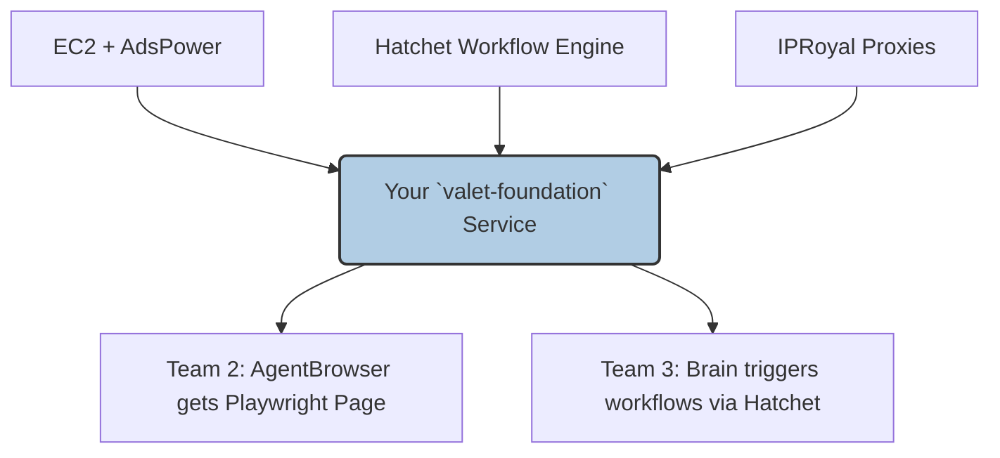

# Prompt for Team 1: The Foundation (Hatchet + EC2 + AdsPower)

**项目代号**: `valet-foundation`

## 1. High-Level Goal

Your mission is to build the **infrastructure backbone** of Valet v2: a Hatchet-orchestrated workflow engine that can programmatically manage anti-detect browser profiles (AdsPower) running on cloud infrastructure (EC2), and expose them as ready-to-use Playwright connections. You are the foundation upon which all AI agent capabilities will be built.

## 2. Relationship to Valet v2 Architecture

You are building the **Infrastructure Layer** and the **Workflow Orchestration Layer**. You provide browser sessions to Team 2 (AI Engines) and workflow orchestration to Team 3 (Self-Learning Core).



## 3. Relevant Existing & New Tickets

This team is responsible for the following tickets from the Valet v2 plan:

| Ticket          | Title                                                           | Priority | Status |
| --------------- | --------------------------------------------------------------- | -------- | ------ |
| **WEK-47**      | Define Core Interfaces (ITaskEngine, IBrowserEngine, etc.)      | Urgent   | 原有   |
| **WEK-48**      | Implement Hatchet Workflow for Job Application Pipeline         | Urgent   | 原有   |
| **WEK-49**      | Implement SandboxController for Multi-Environment Orchestration | Urgent   | 原有   |
| **WEK-52**      | Integrate EC2 + AdsPower as Local Browser Provider              | High     | 原有   |
| **WEK-59**      | Implement Task Pause/Resume via Hatchet Durable Events          | High     | 原有   |
| **WEK-62**      | Integrate Hatchet Streaming for Real-Time Task Progress         | High     | 原有   |
| **WEK-64 (新)** | EC2 + AdsPower Environment Setup (IaC)                          | Urgent   | 新增   |
| **WEK-65 (新)** | Implement IProxyManager (IPRoyal Integration)                   | High     | 新增   |
| **WEK-66 (新)** | Implement IHumanInterventionHandler (VNC/LiveView)              | Medium   | 新增   |

## 4. Key Responsibilities

### 4.1 Infrastructure as Code (WEK-64)

Develop Terraform or Pulumi scripts to provision EC2 instances pre-configured with AdsPower. The instance should have AdsPower installed and its local API accessible. Reference implementation: `https://github.com/Shluo03/axon-browser-worker.git`.

### 4.2 Core Interfaces (WEK-47)

Define and implement the shared TypeScript interfaces that all teams will use. These are already partially designed in the existing Valet docs (`01-shared-interfaces`). Key interfaces include:

```typescript
// IBrowserProvider - How to get a browser session
export interface IBrowserProvider {
  createSession(config: BrowserSessionConfig): Promise<BrowserSession>;
  destroySession(sessionId: string): Promise<void>;
}

export interface BrowserSessionConfig {
  provider: "adspower" | "browserbase" | "local";
  adsPowerProfileId?: string;
  proxyConfig?: ProxyConfig;
}

export interface BrowserSession {
  sessionId: string;
  playwrightEndpoint: string; // ws:// connection string
  vncEndpoint?: string; // For human intervention
}

// IProxyManager
export interface IProxyManager {
  getProxy(region?: string): Promise<ProxyConfig>;
  releaseProxy(proxyId: string): Promise<void>;
}

export interface ProxyConfig {
  provider: "iproyal" | "brightdata";
  host: string;
  port: number;
  username: string;
  password: string;
}
```

### 4.3 Hatchet Workflow Engine (WEK-48, WEK-59, WEK-62)

Implement the core Hatchet workflows. The main workflow is the **Job Application Pipeline**:

```typescript
// Hatchet workflow definition
const jobApplicationWorkflow = hatchet.workflow({
  name: "job-application",
  on: { event: "job:apply" },
});

jobApplicationWorkflow.step("acquire-browser", async (ctx) => {
  const session = await browserProvider.createSession(ctx.input.browserConfig);
  return { session };
});

jobApplicationWorkflow.step("execute-task", async (ctx) => {
  // This is where Team 3's ExecutionEngine will be called
  // For now, just pass through the Playwright endpoint
  return { playwrightEndpoint: ctx.prev.session.playwrightEndpoint };
});

jobApplicationWorkflow.step("release-browser", async (ctx) => {
  await browserProvider.destroySession(ctx.prev.session.sessionId);
});
```

Key features to implement:

- **Pause/Resume (WEK-59)**: Use Hatchet's durable events to allow workflows to pause (e.g., waiting for human CAPTCHA solving) and resume.
- **Streaming (WEK-62)**: Use Hatchet's `ctx.putStream()` to push real-time progress updates to the frontend.

### 4.4 AdsPower API Integration (WEK-52)

Implement a client to communicate with the AdsPower local API:

```typescript
export class AdsPowerClient {
  constructor(private baseUrl: string); // e.g., http://localhost:50325

  async startProfile(profileId: string): Promise<{ playwrightEndpoint: string }>;
  async stopProfile(profileId: string): Promise<void>;
  async getProfileStatus(profileId: string): Promise<'running' | 'stopped'>;
  async listProfiles(): Promise<AdsPowerProfile[]>;
}
```

### 4.5 Proxy Manager (WEK-65)

Implement `IProxyManager` with IPRoyal as the primary provider. Support sticky sessions and region-based proxy selection.

### 4.6 Human Intervention Handler (WEK-66)

Implement `IHumanInterventionHandler` that exposes a VNC endpoint for manual takeover when the agent encounters CAPTCHAs or other blockers. This should integrate with Hatchet's pause/resume mechanism.

## 5. Interface Contract (Your API for Team 2 & 3)

**REST API Endpoints**:

| Method   | Path                                 | Description                        |
| -------- | ------------------------------------ | ---------------------------------- |
| `POST`   | `/api/v1/browser/session`            | Create a new browser session       |
| `DELETE` | `/api/v1/browser/session/:id`        | Destroy a browser session          |
| `GET`    | `/api/v1/browser/session/:id/status` | Get session status                 |
| `POST`   | `/api/v1/workflows/job-apply`        | Trigger a job application workflow |
| `POST`   | `/api/v1/workflows/:id/pause`        | Pause a running workflow           |
| `POST`   | `/api/v1/workflows/:id/resume`       | Resume a paused workflow           |
| `GET`    | `/api/v1/workflows/:id/stream`       | SSE stream for real-time progress  |

**Example: Create Session**

Request:

```json
{
  "provider": "adspower",
  "adsPowerProfileId": "jk8s9d2f",
  "proxyConfig": {
    "provider": "iproyal",
    "region": "us-east"
  }
}
```

Response:

```json
{
  "sessionId": "sess_abc123",
  "playwrightEndpoint": "ws://10.0.1.5:9222/devtools/browser/...",
  "vncEndpoint": "vnc://10.0.1.5:5900"
}
```

## 6. Tech Stack

| Component           | Technology                     |
| ------------------- | ------------------------------ |
| Language            | TypeScript                     |
| Framework           | NestJS                         |
| Workflow Engine     | Hatchet                        |
| IaC                 | Terraform or Pulumi            |
| Browser Anti-Detect | AdsPower Local API             |
| Proxy               | IPRoyal API                    |
| Testing             | Jest (Strict TDD is mandatory) |

## 7. TDD First Steps

1.  **DO NOT** write any implementation code first.
2.  Start by creating `adspower.client.spec.ts`. Write a test that mocks the HTTP calls to AdsPower's local API and asserts that `startProfile` returns a valid `playwrightEndpoint`.
3.  Create `browser.provider.spec.ts`. Write a test that mocks the `AdsPowerClient` and asserts that `createSession` returns a valid `BrowserSession` object.
4.  Create `job-application.workflow.spec.ts`. Write a test that asserts the workflow steps execute in the correct order: `acquire-browser` → `execute-task` → `release-browser`.
5.  Run all tests. They will fail. Now, start building the implementations to make them pass.

## 8. Definition of Done

- All API endpoints are implemented and have 100% test coverage.
- Terraform/Pulumi scripts can successfully launch a pre-configured EC2 instance with AdsPower.
- The service can successfully start an AdsPower profile and return a valid Playwright endpoint.
- Hatchet workflows for job application, pause/resume, and streaming are functional.
- A clear README.md explaining how to configure and run the service.
- A Postman collection for all API endpoints.
