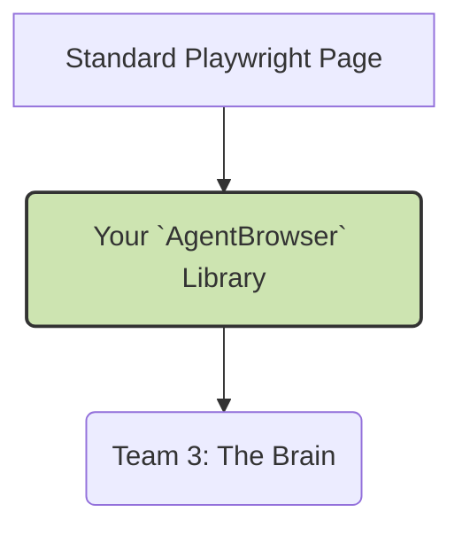

# Prompt for Team 2: The Hands (AI Engine & Humanization)

**项目代号**: `valet-hands`

## 1. High-Level Goal

Your mission is to create a powerful library that wraps a raw Playwright browser connection and endows it with **(1) human-like interaction patterns** and **(2) advanced AI-agentic capabilities** from Stagehand and Magnitude. You are the “hands” of the agent. Your work is completely independent of how the browser is launched; you can test with a local browser instance.

## 2. Relationship to Valet v2 Architecture

You are building the **Browser Engine Layer** and the **Human Cloak Layer**. You consume a standard Playwright `Page` object and provide an enhanced `AgentBrowser` to Team 3.



## 3. Relevant Existing & New Tickets

This team is responsible for the following tickets from the Valet v2 plan:

- **WEK-63 (新)**: **Implement Human Cloak Layer v1** (Your core responsibility)
- **WEK-50 (原)**: Integrate Stagehand Engine
- **WEK-53 (原)**: Integrate Magnitude Engine
- **WEK-60 (原, 扩展)**: Expand Stagehand Agent Mode
- **WEK-61 (原, 扩展)**: Expand Magnitude Multi-Screenshot

## 4. Key Responsibilities

1.  **Human Cloak Layer**: Implement a `HumanizedPage` class that wraps Playwright's `Page` object. This class will override methods like `click` and `type` with human-like behavior.
    - `humanClick`: Use Bézier curves to generate a non-linear mouse path to the target element.
    - `humanType`: Use a Markov chain model to simulate realistic typing speed, rhythm, and even occasional mistakes.
2.  **AI Engine Integration**: Create wrappers for the Stagehand and Magnitude clients. These wrappers will take a `HumanizedPage` object and a high-level goal (e.g., "click the login button") as input.
3.  **Unified Interface**: Expose a single, unified `AgentBrowser` class that can seamlessly switch between direct Playwright commands, humanized commands, and AI-driven commands.

## 5. Interface Contract (Your API for Team 3)

You will deliver a TypeScript library. The main entry point will be the `AgentBrowser` class.

```typescript
// The class you will provide to Team 3
export class AgentBrowser {
  private humanizedPage: HumanizedPage;

  constructor(page: Page); // Accepts any standard Playwright Page

  // Humanized actions
  async humanClick(selector: string, reason: string): Promise<void>;
  async humanType(selector: string, text: string, reason: string): Promise<void>;

  // AI-driven actions
  async stagehandAct(goal: string): Promise<{ actionTrace: any[] }>;
  async magnitudeAct(goal: string, screenshot: Buffer): Promise<{ actionTrace: any[] }>;

  // Observation for learning
  async observe(): Promise<{ elements: ParsedElement[] }>; // Based on Stagehand.observe()

  // Raw access if needed
  get rawPage(): Page;

  async close(): Promise<void>;
}
```

## 6. Tech Stack

- **Language**: TypeScript
- **Core Library**: Playwright
- **AI Engines**: `@browserbase/stagehand`, `@magnitudedev/browser-agent`
- **Testing**: Jest (Strict TDD is mandatory)

## 7. TDD First Steps

1.  **Setup**: Create a new TypeScript library project. Install Playwright and Jest.
2.  **Start with `humanized.page.spec.ts`**: Your first test should be for `humanClick`. You can't test the Bézier curve visually, but you can test the outcome.
    ```typescript
    it("should successfully click a button when humanClick is called", async () => {
      const browser = await chromium.launch();
      const page = await browser.newPage();
      await page.setContent('<button onclick="window.clicked=true">Click Me</button>');

      const humanizedPage = new HumanizedPage(page);
      await humanizedPage.humanClick("button");

      const wasClicked = await page.evaluate(() => window.clicked);
      expect(wasClicked).toBe(true);

      await browser.close();
    });
    ```
3.  **Run the test**. It will fail. Now, create the `HumanizedPage` class and the `humanClick` method to make it pass.
4.  **Mock AI Engines**: For testing `stagehandAct` and `magnitudeAct`, mock the `@browserbase/stagehand` and `@magnitudedev/browser-agent` libraries using `jest.mock()` to ensure your wrapper calls them with the correct parameters.

## 8. Definition of Done

- The `AgentBrowser` library is published to a private NPM registry.
- All public methods of `AgentBrowser` and `HumanizedPage` have 100% test coverage.
- A clear README.md with usage examples for each method is provided.
