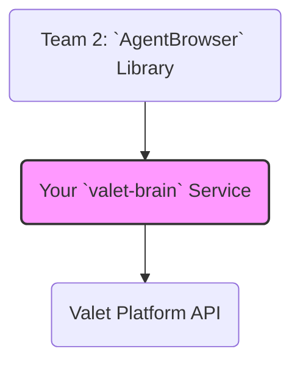

# Prompt for Team 3: The Brain (Self-Learning Core)

**项目代号**: `valet-brain`

## 1. High-Level Goal

Your mission is to build the **memory and decision-making center** of Valet v2. You will create a “Self-Learning Core” that decides when to use pre-existing knowledge (“manuals”) for fast, cheap execution, and when to trigger AI-powered exploration. You will also be responsible for **learning from these explorations**. Your work is independent of the other two teams, as you will be working against mocked interfaces.

## 2. Relationship to Valet v2 Architecture

You are building the **Self-Learning Core**. You consume the `AgentBrowser` library from Team 2 and provide the main task execution API for the entire Valet platform.



## 3. Relevant Existing & New Tickets

This team is responsible for the following tickets from the Valet v2 plan:

- **WEK-67 (新)**: **Design Action Manuals Database Schema** (Your core responsibility)
- **WEK-68 (新)**: **Implement Manual Manager Service v1**
- **WEK-69 (新)**: **Implement Execution Engine v1 (Reuse Mode)**
- **WEK-70 (新)**: Implement Manual Generation from Stagehand (Part of your learning loop)
- **WEK-71 (新)**: Implement Manual Generation from Magnitude (Part of your learning loop)
- **WEK-72 (新)**: Implement IFormAnalyzer (LLM Form Filling)
- **WEK-47/48/49 (原)**: Define Core Interfaces & Hatchet Workflow (You will implement the server-side logic for this)

## 4. Key Responsibilities

1.  **Database Schema**: Design and implement a database schema (using Prisma) to store “Action Manuals”. This schema must be based on ActionBook's `ParsedElements` and include fields like `selector`, `action`, `description`, and `healthScore`.
2.  **Manual Manager Service**: Create a NestJS service (`ManualManager`) that exposes an API for querying, creating, and updating these manuals.
3.  **Execution Engine**: Develop the core decision-making logic. This engine will receive a task, query the `ManualManager`, and decide whether to execute in “Reuse Mode” (using a found manual) or “Explore Mode” (delegating to the `AgentBrowser` from Team 2).
4.  **Learning Loop**: After a successful exploration by the `AgentBrowser`, your service must receive the successful action trace and use it to generate and save a new, high-quality Action Manual.

## 5. Interface Contract (Your API for the World)

You will provide the main task execution API and consume the library from Team 2.

```typescript
// The mocked contract you consume from Team 2
// You will create a mock implementation of this for your tests.
class MockAgentBrowser {
  async humanClick(selector: string, reason: string): Promise<void> { ... }
  async stagehandAct(goal: string): Promise<{ actionTrace: any[] }> { ... }
  async observe(): Promise<{ elements: ParsedElement[] }> { ... }
}
```

**Your Core Service API**:

**Endpoint**: `POST /api/v1/tasks/execute`

**Request Body**:

```json
{
  "browserConfig": { "adsPowerProfileId": "..." }, // This will be passed to Team 1 eventually
  "task": {
    "name": "Apply for Job on Workday",
    "startUrl": "https://...",
    "steps": [
      { "goal": "Click the Apply button" },
      { "goal": "Fill in the First Name field with 'John'" }
    ]
  }
}
```

## 6. Tech Stack

- **Language**: TypeScript
- **Framework**: NestJS
- **ORM**: Prisma
- **Database**: PostgreSQL
- **Testing**: Jest (Strict TDD is mandatory)

## 7. TDD First Steps

1.  **Setup**: Create a new NestJS project. Install Prisma and Jest.
2.  **Start with `prisma/schema.prisma`**: Define the `ActionManual` and `ManualStep` models. Your `ManualStep` model should contain fields like `selector`, `action`, `description`, `elementType`, etc. Run `prisma generate`.
3.  **Write `manual.manager.spec.ts`**: Your first test should be `it('should return null for a non-existent manual', ...)`. Your second test should be `it('should create and then retrieve a manual', ...)`. Use an in-memory SQLite database for testing.
4.  **Write `execution.engine.spec.ts`**: Mock the `ManualManager` and the `AgentBrowser` (from Team 2).
    - Test 1: If `manualManager.findManual` returns a manual, assert that `agentBrowser.humanClick` is called.
    - Test 2: If it returns null, assert that `agentBrowser.stagehandAct` is called.
    - Test 3: After `stagehandAct` is called, assert that `manualManager.createManualFromTrace` is called.
5.  **Run tests**. They will fail. Now, implement the services to make them pass.

## 8. Definition of Done

- Prisma schema is finalized and migrated.
- `ManualManager` service API is fully implemented and tested.
- `ExecutionEngine` can correctly switch between “Reuse” and “Explore” modes.
- The learning loop (creating a manual from a trace) is implemented and tested.
- A Postman collection is provided to demonstrate the `/api/v1/tasks/execute` endpoint using mocked downstream services.
