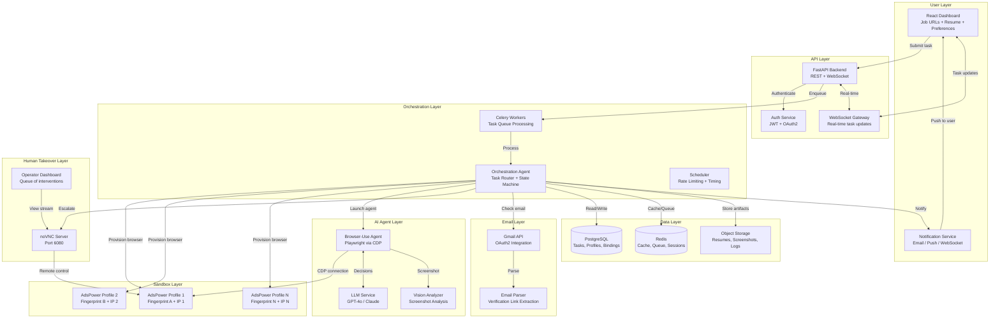
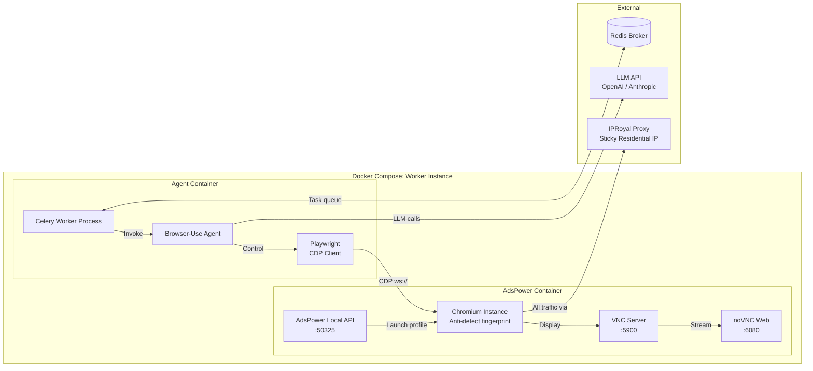
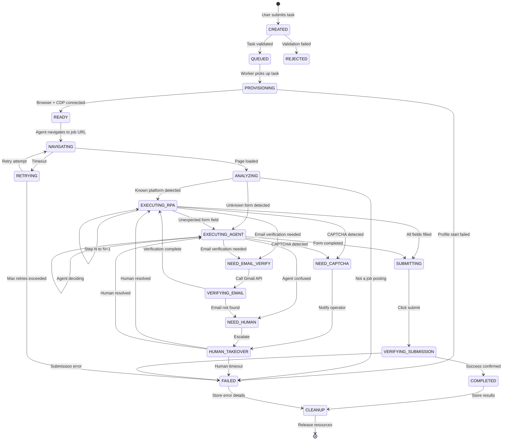
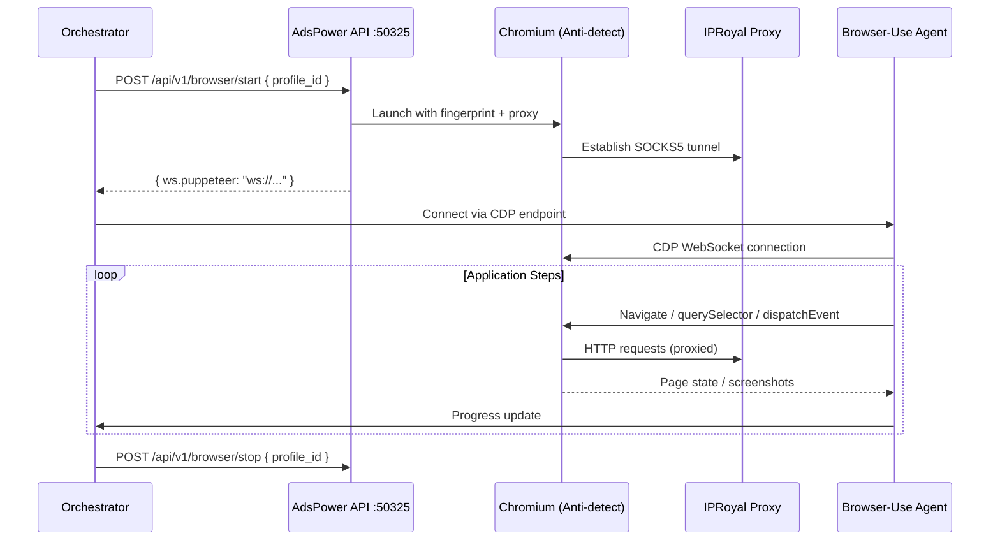
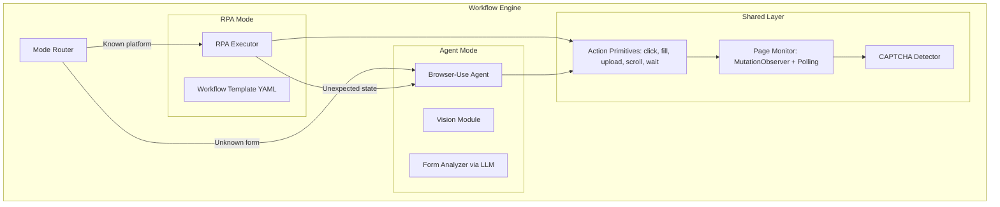
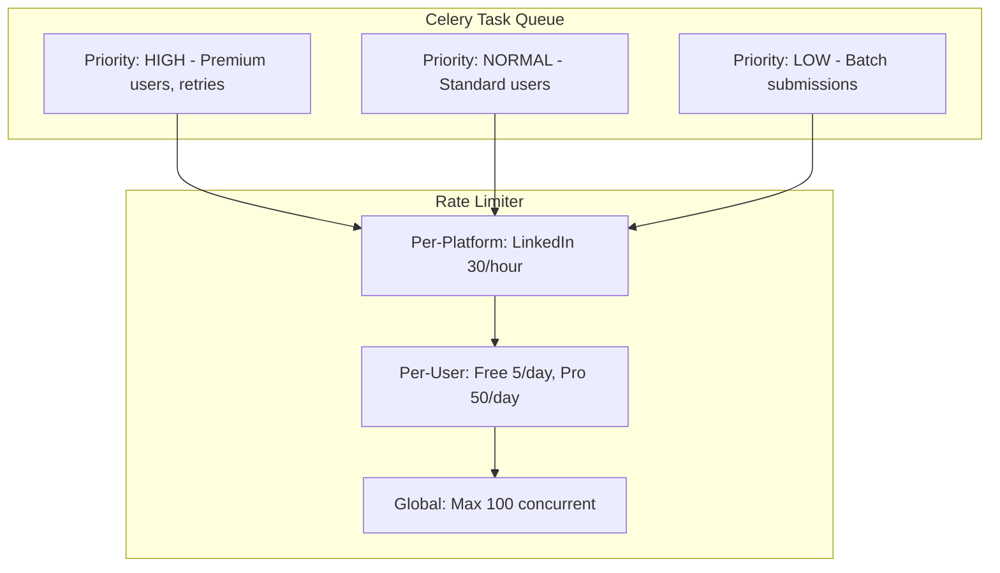
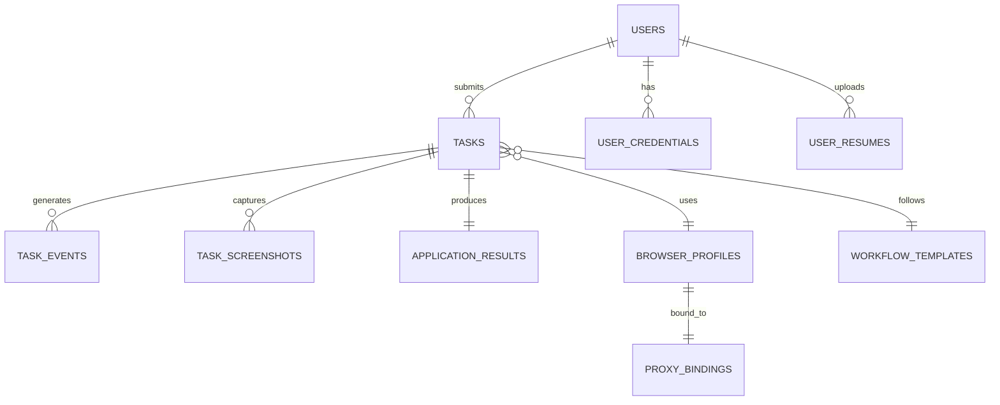

# Async Auto-Resume-Submission System -- System Architecture

> **Version**: 0.1.0-draft
> **Last Updated**: 2026-02-10
> **Status**: Architecture Design Phase

---

## Table of Contents

1. [Executive Summary](#1-executive-summary)
2. [High-Level Architecture](#2-high-level-architecture)
3. [Orchestration Agent Design](#3-orchestration-agent-design)
4. [Hybrid RPA + LLM Execution Engine](#4-hybrid-rpa--llm-execution-engine)
5. [Task Lifecycle & State Machine](#5-task-lifecycle--state-machine)
6. [Data Model](#6-data-model)
7. [Scaling Strategy](#7-scaling-strategy)
8. [Security Considerations](#8-security-considerations)
9. [Cost Model](#9-cost-model)

---

## 1. Executive Summary

This document describes the architecture for an **asynchronous, AI-agent-driven job application system** that submits resumes and completes job applications on behalf of users. The system operates inside **sandboxed anti-detect browser environments** (AdsPower) with dedicated residential IP proxies, orchestrated by an AI agent layer (Browser-Use + LLM) with human-in-the-loop fallback for CAPTCHAs and edge cases.

### Core Design Principles

1. **One account = one fingerprint = one IP.** Every job platform account is bound to a unique AdsPower browser profile with a stable device fingerprint and a sticky residential IP.
2. **AI-first, human-fallback.** The system attempts full automation via LLM-powered browser agents. When it encounters CAPTCHAs, ambiguous forms, or verification challenges, it escalates to a human operator via noVNC.
3. **Deterministic where possible, intelligent where necessary.** Well-known application flows use fixed RPA scripts. Unknown forms use the LLM agent.
4. **Async by default.** Users submit tasks and walk away. The system processes them through a queue.
5. **Observable and auditable.** Every action is logged, every page is screenshotted.

### Key Technology Choices

| Layer                   | Technology                  | Rationale                                             |
| ----------------------- | --------------------------- | ----------------------------------------------------- |
| Anti-detect browser     | AdsPower (Local API)        | Industry-standard fingerprint management, CDP support |
| Browser automation      | Browser-Use + Playwright    | LLM-native browser control via CDP                    |
| LLM backbone            | GPT-4o / Claude Sonnet      | Vision capability for form analysis                   |
| Task queue              | Celery + Redis              | Battle-tested async task processing                   |
| Human takeover          | noVNC (port 6080)           | Zero-install remote browser access                    |
| Email verification      | Gmail API (OAuth2)          | Programmatic access to verification emails            |
| Proxy provider          | IPRoyal                     | Residential/mobile sticky sessions                    |
| Database                | PostgreSQL                  | Relational integrity for bindings                     |
| Cache/broker            | Redis                       | Celery broker, session cache, rate limiting           |
| Container orchestration | Docker Compose / Kubernetes | Isolation per browser instance                        |

---

## 2. High-Level Architecture

### 2.1 System Overview Diagram



### 2.2 Single Worker Instance (Docker Composition)



### 2.3 Port Mapping

| Port  | Service            | Purpose                               |
| ----- | ------------------ | ------------------------------------- |
| 50325 | AdsPower Local API | Browser profile management            |
| 5900  | VNC                | Raw VNC protocol                      |
| 6080  | noVNC              | Web-based VNC client (human takeover) |
| 9222+ | Chrome DevTools    | CDP WebSocket endpoint (dynamic)      |

---

## 3. Orchestration Agent Design

### 3.1 Orchestrator State Machine



### 3.2 Orchestrator Core Logic (Pseudocode)

```python
class OrchestrationAgent:
    def __init__(self, task: ApplicationTask, config: OrchestratorConfig):
        self.task = task
        self.config = config
        self.state = TaskState.CREATED
        self.browser_profile = None
        self.cdp_endpoint = None
        self.agent = None

    async def execute(self) -> TaskResult:
        try:
            # Phase 1: Provision
            self.transition(TaskState.PROVISIONING)
            await self._provision_browser()

            # Phase 2: Navigate
            self.transition(TaskState.NAVIGATING)
            await self._navigate_to_job()

            # Phase 3: Analyze
            self.transition(TaskState.ANALYZING)
            execution_mode = await self._analyze_page()

            # Phase 4: Execute (RPA or Agent mode)
            if execution_mode == ExecutionMode.RPA:
                self.transition(TaskState.EXECUTING_RPA)
                await self._execute_rpa_workflow()
            else:
                self.transition(TaskState.EXECUTING_AGENT)
                await self._execute_agent_workflow()

            # Phase 5: Submit
            self.transition(TaskState.SUBMITTING)
            await self._submit_application()

            # Phase 6: Verify
            self.transition(TaskState.VERIFYING_SUBMISSION)
            result = await self._verify_submission()

            self.transition(TaskState.COMPLETED)
            return result

        except CaptchaDetectedError:
            return await self._handle_captcha()
        except EmailVerificationRequired as e:
            return await self._handle_email_verification(e)
        except AgentConfusedError:
            return await self._handle_human_escalation()
        except MaxRetriesExceeded:
            self.transition(TaskState.FAILED)
            return TaskResult(success=False, error="Max retries exceeded")
        finally:
            await self._cleanup()

    async def _provision_browser(self):
        """
        AdsPower Local API flow:
        1. POST /api/v1/browser/start -> Returns CDP WebSocket URL
        2. Connect Playwright to the CDP endpoint
        3. Verify proxy is working (check IP)
        """
        self.browser_profile = await self.profile_pool.acquire(
            user_id=self.task.user_id,
            platform=self.task.platform,
        )

        response = await adspower_client.start_browser(
            profile_id=self.browser_profile.adspower_profile_id,
        )
        self.cdp_endpoint = response["data"]["ws"]["puppeteer"]

        self.agent = await BrowserUseAgent.connect(
            cdp_url=self.cdp_endpoint,
            llm=self.config.llm_provider,
            task_context=self._build_task_context()
        )

        # Verify proxy IP
        actual_ip = await self.agent.execute_script(
            "return await fetch('https://api.ipify.org').then(r => r.text())"
        )
        assert actual_ip == self.browser_profile.bound_ip

    async def _handle_captcha(self) -> TaskResult:
        self.transition(TaskState.NEED_CAPTCHA)
        screenshot = await self.agent.screenshot()

        await self.notify_operator(
            task_id=self.task.id,
            reason="CAPTCHA detected",
            novnc_url=self._get_novnc_url(),
        )

        self.transition(TaskState.HUMAN_TAKEOVER)
        resolved = await self._wait_for_human_resolution(
            timeout=self.config.human_timeout
        )

        if not resolved:
            self.transition(TaskState.FAILED)
            return TaskResult(success=False, error="CAPTCHA not resolved in time")

        # Resume automation
        return await self.execute()

    async def _handle_email_verification(self, error):
        self.transition(TaskState.NEED_EMAIL_VERIFY)

        verification_link = await gmail_service.wait_for_verification_email(
            email=self.task.user_email,
            sender_patterns=error.sender_hints,
            timeout=120,
            poll_interval=5
        )

        if not verification_link:
            return await self._handle_human_escalation()

        await self.agent.navigate(verification_link)
        await asyncio.sleep(3)
        await self.agent.navigate(self.task.job_url)
        return await self.execute()
```

### 3.3 AdsPower Local API Integration



**Key AdsPower API endpoints:**

| Method | Endpoint                 | Purpose                        |
| ------ | ------------------------ | ------------------------------ |
| `POST` | `/api/v1/user/create`    | Create new browser profile     |
| `POST` | `/api/v1/browser/start`  | Start browser, returns CDP URL |
| `GET`  | `/api/v1/browser/active` | Check if profile is running    |
| `POST` | `/api/v1/browser/stop`   | Stop browser instance          |
| `POST` | `/api/v1/user/update`    | Update proxy settings          |

### 3.4 Browser-Use Agent Integration via CDP

```python
from browser_use import Agent, Browser, BrowserConfig
from langchain_openai import ChatOpenAI

async def create_agent_for_adspower(cdp_url: str, task: str) -> Agent:
    """Connect Browser-Use to existing AdsPower browser via CDP."""
    browser_config = BrowserConfig(
        cdp_url=cdp_url,      # ws://127.0.0.1:{port}/devtools/browser/{id}
        headless=False,
        disable_security=False,
    )
    browser = Browser(config=browser_config)

    llm = ChatOpenAI(
        model="gpt-4o",
        temperature=0.1,
        max_tokens=4096,
    )

    agent = Agent(
        task=task,
        llm=llm,
        browser=browser,
        use_vision=True,
        max_actions_per_step=5,
        max_failures=3,
    )
    return agent
```

**Why CDP connection to AdsPower matters:**

- Playwright's default browser launch creates vanilla Chromium with no fingerprint protection
- By connecting via CDP, the agent controls a browser with: canvas fingerprint spoofing, WebGL noise, timezone/language matching, WebRTC IP leak prevention
- The LLM agent is unaware it is controlling an anti-detect browser

---

## 4. Hybrid RPA + LLM Execution Engine

### 4.1 Execution Mode Architecture



### 4.2 Action Type Taxonomy

| Action Type       | Mode  | Description                  | Example                          |
| ----------------- | ----- | ---------------------------- | -------------------------------- |
| `RPA_CLICK`       | RPA   | Click a known selector       | Click "Easy Apply" button        |
| `RPA_FILL`        | RPA   | Fill a field with known data | Type email in input              |
| `RPA_SELECT`      | RPA   | Select dropdown option       | Choose "5+ years"                |
| `RPA_UPLOAD`      | RPA   | Upload file to known input   | Upload resume                    |
| `RPA_SCROLL`      | RPA   | Scroll to element            | Scroll to submit button          |
| `RPA_WAIT`        | RPA   | Wait for selector/condition  | Wait for form load               |
| `AGENT_DECIDE`    | Agent | LLM analyzes page            | Determine which button is "Next" |
| `AGENT_FILL_FORM` | Agent | LLM maps user data to fields | Fill custom form                 |
| `AGENT_ANSWER`    | Agent | LLM generates answer         | "Why do you want this role?"     |
| `HUMAN_TAKEOVER`  | Human | Pause, open noVNC            | CAPTCHA solving                  |
| `EMAIL_VERIFY`    | Auto  | Check email, extract link    | Email confirmation               |

### 4.3 LinkedIn Easy Apply Workflow Template

```yaml
platform: linkedin
workflow_name: easy_apply
version: "2.0"
url_pattern: "linkedin\\.com/jobs/view/\\d+"
detection:
  selectors:
    - ".jobs-apply-button--top-card"
    - "button.jobs-apply-button"

steps:
  - id: click_easy_apply
    action: RPA_CLICK
    selector: "button.jobs-apply-button"
    wait_after: 2000

  - id: fill_contact_info
    action: RPA_FILL_FORM
    field_mapping:
      "input[name='firstName']": "user.first_name"
      "input[name='lastName']": "user.last_name"
      "input[name='email']": "user.email"
      "input[name='phone']": "user.phone"
    skip_if_prefilled: true

  - id: upload_resume
    action: RPA_UPLOAD
    trigger_selector: "button:has-text('Upload resume')"
    input_selector: "input[type='file']"
    file_source: "user.resume_path"

  - id: handle_screening_questions
    action: AGENT_FILL_FORM
    # Switch to Agent mode for dynamic screening questions
    context_fields:
      - "user.years_of_experience"
      - "user.work_authorization"
      - "user.salary_expectation"
    max_agent_steps: 10

  - id: navigate_to_submit
    action: RPA_CLICK
    loop:
      click_selector: "button[aria-label='Continue to next step']"
      until_selector: "button[aria-label='Submit application']"
      max_iterations: 5
      delay_between: 1500

  - id: submit
    action: RPA_CLICK
    selector: "button[aria-label='Submit application']"
    wait_after: 3000

  - id: verify_success
    action: RPA_WAIT
    selector: ".artdeco-inline-feedback--success"
    timeout: 10000

error_handlers:
  - trigger: "captcha_detected"
    selectors: ["iframe[src*='captcha']", "iframe[src*='recaptcha']"]
    action: HUMAN_TAKEOVER

  - trigger: "already_applied"
    selectors: ["span:has-text('Applied')"]
    action: SKIP
```

### 4.4 Hybrid Mode Switching

```python
class HybridExecutionEngine:
    async def execute_step(self, step: WorkflowStep) -> StepResult:
        match step.action:
            case "RPA_CLICK" | "RPA_FILL" | "RPA_SELECT" | "RPA_UPLOAD":
                return await self._execute_rpa_action(step)
            case "AGENT_DECIDE" | "AGENT_FILL_FORM" | "AGENT_ANSWER":
                return await self._execute_agent_action(step)
            case "HUMAN_TAKEOVER":
                return await self._escalate_to_human(step)
            case "EMAIL_VERIFY":
                return await self._handle_email_verification(step)

    async def _execute_rpa_action(self, step) -> StepResult:
        try:
            element = await self.page.wait_for_selector(step.selector, timeout=5000)
            if not element:
                # Fall back to Agent mode
                return await self._execute_agent_action(step.to_agent_step())

            match step.action:
                case "RPA_CLICK": await element.click()
                case "RPA_FILL": await element.fill(self._resolve_value(step.value))
                case "RPA_SELECT": await element.select_option(step.value)
                case "RPA_UPLOAD": await element.set_input_files(step.file_source)

            if step.wait_after:
                await asyncio.sleep(step.wait_after / 1000)
            return StepResult(success=True)

        except TimeoutError:
            return await self._execute_agent_action(step.to_agent_step())
```

---

## 5. Task Lifecycle & State Machine

### 5.1 State Transition Table

| Current State    | Event               | Next State          | Timeout |
| ---------------- | ------------------- | ------------------- | ------- |
| `CREATED`        | validate            | `QUEUED`            | 5s      |
| `QUEUED`         | worker_acquired     | `PROVISIONING`      | 300s    |
| `PROVISIONING`   | profile_started     | `READY`             | 30s     |
| `READY`          | begin               | `NAVIGATING`        | -       |
| `NAVIGATING`     | page_loaded         | `ANALYZING`         | 30s     |
| `ANALYZING`      | template_match      | `EXECUTING_RPA`     | 10s     |
| `ANALYZING`      | no_template         | `EXECUTING_AGENT`   | 10s     |
| `EXECUTING_*`    | captcha_detected    | `NEED_CAPTCHA`      | -       |
| `EXECUTING_*`    | email_verify_needed | `NEED_EMAIL_VERIFY` | -       |
| `EXECUTING_*`    | form_complete       | `SUBMITTING`        | 120s    |
| `HUMAN_TAKEOVER` | human_resolved      | `EXECUTING_*`       | 300s    |
| `HUMAN_TAKEOVER` | timeout             | `FAILED`            | -       |
| `SUBMITTING`     | success_confirmed   | `COMPLETED`         | 15s     |
| `COMPLETED`      | save_artifacts      | `CLEANUP`           | 30s     |

### 5.2 Retry Strategy

```python
RETRY_CONFIG = {
    "max_retries": 3,
    "retry_delays": [5, 15, 45],  # exponential backoff
    "retryable_states": ["NAVIGATING", "PROVISIONING", "CDP_CONNECTING"],
    "non_retryable_errors": [
        "already_applied", "job_closed", "login_required", "account_restricted"
    ],
}
```

### 5.3 Concurrent Task Management



---

## 6. Data Model

### 6.1 Entity Relationship



### 6.2 SQL Schema (Key Tables)

```sql
CREATE TYPE task_status AS ENUM (
    'CREATED', 'QUEUED', 'PROVISIONING', 'READY',
    'NAVIGATING', 'ANALYZING', 'EXECUTING_RPA', 'EXECUTING_AGENT',
    'NEED_CAPTCHA', 'NEED_EMAIL_VERIFY', 'NEED_HUMAN',
    'HUMAN_TAKEOVER', 'CHECKING_EMAIL', 'SUBMITTING',
    'VERIFYING', 'COMPLETED', 'FAILED', 'REJECTED',
    'RETRYING', 'CLEANUP', 'CANCELLED'
);

CREATE TABLE users (
    id              UUID PRIMARY KEY DEFAULT gen_random_uuid(),
    email           VARCHAR(255) UNIQUE NOT NULL,
    name            VARCHAR(255) NOT NULL,
    hashed_password VARCHAR(255) NOT NULL,
    preferences     JSONB DEFAULT '{}',
    subscription_tier VARCHAR(50) DEFAULT 'free',
    created_at      TIMESTAMPTZ DEFAULT NOW(),
    is_active       BOOLEAN DEFAULT TRUE
);

CREATE TABLE tasks (
    id                  UUID PRIMARY KEY DEFAULT gen_random_uuid(),
    user_id             UUID NOT NULL REFERENCES users(id),
    job_url             TEXT NOT NULL,
    platform            VARCHAR(50) NOT NULL,
    status              task_status NOT NULL DEFAULT 'CREATED',
    browser_profile_id  UUID REFERENCES browser_profiles(id),
    resume_id           UUID REFERENCES user_resumes(id),
    user_preferences    JSONB DEFAULT '{}',
    retry_count         INTEGER DEFAULT 0,
    priority            INTEGER DEFAULT 0,
    created_at          TIMESTAMPTZ DEFAULT NOW(),
    started_at          TIMESTAMPTZ,
    completed_at        TIMESTAMPTZ,
    error_message       TEXT
);

CREATE INDEX idx_tasks_user_status ON tasks(user_id, status);
CREATE INDEX idx_tasks_status_priority ON tasks(status, priority DESC);

CREATE TABLE browser_profiles (
    id                      UUID PRIMARY KEY DEFAULT gen_random_uuid(),
    adspower_profile_id     VARCHAR(100) UNIQUE NOT NULL,
    assigned_user_id        UUID REFERENCES users(id),
    platform                VARCHAR(50) NOT NULL,
    status                  VARCHAR(20) DEFAULT 'AVAILABLE',
    fingerprint_config      JSONB NOT NULL,
    proxy_binding_id        UUID REFERENCES proxy_bindings(id),
    total_tasks_completed   INTEGER DEFAULT 0,
    last_used_at            TIMESTAMPTZ,
    created_at              TIMESTAMPTZ DEFAULT NOW()
);

CREATE TABLE proxy_bindings (
    id              UUID PRIMARY KEY DEFAULT gen_random_uuid(),
    provider        VARCHAR(50) DEFAULT 'iproyal',
    proxy_type      VARCHAR(20) DEFAULT 'socks5',
    ip_address      INET,
    hostname        VARCHAR(255) NOT NULL,
    port            INTEGER NOT NULL,
    username        VARCHAR(255),
    encrypted_password BYTEA,
    country         VARCHAR(10) DEFAULT 'US',
    session_id      VARCHAR(255),
    status          VARCHAR(20) DEFAULT 'ACTIVE'
);

CREATE TABLE application_results (
    id                  UUID PRIMARY KEY DEFAULT gen_random_uuid(),
    task_id             UUID UNIQUE NOT NULL REFERENCES tasks(id),
    platform            VARCHAR(50) NOT NULL,
    job_title           VARCHAR(500),
    company_name        VARCHAR(255),
    application_status  VARCHAR(50) NOT NULL,
    confirmation_id     VARCHAR(255),
    form_data_submitted JSONB DEFAULT '{}',
    applied_at          TIMESTAMPTZ DEFAULT NOW()
);

CREATE TABLE task_events (
    id          UUID PRIMARY KEY DEFAULT gen_random_uuid(),
    task_id     UUID NOT NULL REFERENCES tasks(id) ON DELETE CASCADE,
    event_type  VARCHAR(100) NOT NULL,
    from_state  task_status,
    to_state    task_status,
    event_data  JSONB DEFAULT '{}',
    created_at  TIMESTAMPTZ DEFAULT NOW()
);
```

### 6.3 Redis Key Schema

```
# Rate limiting
ratelimit:platform:{platform}:minute    # INCR with TTL 60s
ratelimit:user:{user_id}:daily          # INCR with TTL 86400s
ratelimit:global:concurrent             # SCARD

# Profile pool
profile:pool:{platform}:available       # SET of available profile IDs
profile:lock:{profile_id}               # Lock with TTL

# Task state cache
task:state:{task_id}                    # Current state
task:progress:{task_id}                 # Progress HASH

# Human takeover
human:queue                             # SORTED SET by priority
```

---

## 7. Scaling Strategy

### 7.1 Growth Phases

| Phase           | Workers | Infrastructure     | Monthly Cost |
| --------------- | ------- | ------------------ | ------------ |
| Phase 1 (POC)   | 1-5     | Single Docker Host | $170-320     |
| Phase 2 (Early) | 5-20    | 2-3 Docker Hosts   | $680-1,280   |
| Phase 3 (Scale) | 20-100  | Kubernetes Cluster | $3,400-6,400 |

### 7.2 Resource Per Worker

| Resource | Per Worker | 5 Workers |
| -------- | ---------- | --------- |
| CPU      | 1.5 vCPU   | 7.5 vCPU  |
| RAM      | 4 GB       | 20 GB     |
| Disk     | 5 GB       | 25 GB     |
| Network  | 1 proxy    | 5 proxies |

### 7.3 Profile Pool Manager

```python
class ProfilePoolManager:
    async def acquire(self, user_id, platform, proxy_country="US"):
        # 1. Check existing user-platform binding (reuse)
        existing = await self.db.get_profile(user_id=user_id, platform=platform)
        if existing:
            return await self._lock_and_return(existing)

        # 2. Try available pool
        available = await self.redis.spop(f"profile:pool:{platform}:available")
        if available:
            profile = await self.db.get_profile_by_id(available)
            profile.assigned_user_id = user_id
            return await self._lock_and_return(profile)

        # 3. Create new profile
        proxy = await self._provision_proxy(proxy_country)
        profile = await self._create_adspower_profile(platform, proxy)
        profile.assigned_user_id = user_id
        return await self._lock_and_return(profile)

    async def release(self, profile_id):
        await self.redis.delete(f"profile:lock:{profile_id}")
        await self.redis.sadd(f"profile:pool:{platform}:available", profile_id)
```

---

## 8. Security Considerations

### 8.1 Credential Encryption

- **AES-256-GCM** envelope encryption with KMS-managed data encryption keys
- Credentials decrypted in-memory only, never written to disk or logs
- OAuth tokens stored encrypted with expiry tracking

### 8.2 Data Isolation

| Boundary         | Mechanism                                           |
| ---------------- | --------------------------------------------------- |
| Browser profiles | Dedicated per user, never shared                    |
| Proxy IPs        | Sticky per user-platform, never reused              |
| Database         | Row-level security (RLS)                            |
| Object storage   | S3 paths prefixed with user_id                      |
| Logs             | Structured with user_id, credential values redacted |

### 8.3 GDPR Compliance

| Requirement       | Implementation                                                |
| ----------------- | ------------------------------------------------------------- |
| Right to access   | Data export API endpoint                                      |
| Right to deletion | Cascade delete: tasks, credentials, resumes, profiles         |
| Data minimization | Parsed resume fields only; original PDF deleted after 30 days |
| Consent           | Legal disclaimer before first use                             |
| Data retention    | Tasks: 90 days, Screenshots: 30 days                          |

---

## 9. Cost Model

### 9.1 Per-Instance Monthly Cost

| Component                    | Cost (USD) |
| ---------------------------- | ---------- |
| ARM cloud server (shared)    | $15-25     |
| Residential proxy (IPRoyal)  | $8-12      |
| LLM API (OpenAI/Anthropic)   | $5-15      |
| AdsPower license (amortized) | $5-10      |
| S3 storage                   | $1-2       |
| **Total per instance**       | **$34-64** |

### 9.2 Scaling Projections

| Scale     | Instances | Monthly Cost | Per-Application |
| --------- | --------- | ------------ | --------------- |
| POC       | 5         | $170-320     | $1.70-3.20      |
| Early     | 20        | $680-1,280   | $0.68-1.28      |
| Scale     | 100       | $3,400-6,400 | $0.34-0.64      |
| Optimized | 100       | $2,500-4,500 | $0.25-0.45      |

---

## Appendix: API Contracts

### Task Submission

```
POST /api/v1/tasks
{
    "job_url": "https://linkedin.com/jobs/view/123",
    "resume_id": "uuid",
    "preferences": {
        "salary_expectation": "$120,000-$150,000",
        "willing_to_relocate": true,
        "visa_sponsorship_needed": false
    }
}
-> 201 { "task_id": "uuid", "status": "QUEUED", "websocket_url": "wss://..." }
```

### WebSocket Task Updates

```json
{ "type": "state_change", "from": "QUEUED", "to": "PROVISIONING" }
{ "type": "progress", "step": "fill_contact_info", "step_number": 2, "total_steps": 7 }
{ "type": "human_needed", "reason": "CAPTCHA", "novnc_url": "https://..." }
{ "type": "completed", "result": { "job_title": "...", "company": "..." } }
```

### Human Takeover Resolution

```
POST /api/v1/tasks/{task_id}/human-resolved
{ "resolution": "captcha_solved", "operator_id": "uuid" }
-> 200 { "status": "EXECUTING_RPA", "message": "Automation resumed" }
```
